# MWiki - Wiki impulsionada por Markdown

## Visão Geral

O MWiki é um **motor wiki** *(wiki engine)* e um software de aplicação web para anotações, voltado para matemática e pesquisa, projetado para comunicação científica e técnica. Este software de motor wiki possui uma linguagem de marcação leve e rica em semântica, baseada em MyST Markdown, Obsidian Markdown e na linguagem de marcação do motor Media Wiki.

Este aplicativo Python é suportado pelo framework web Python Flask e pelo parser extensível Markdown-it usado pelo MyST Markdown e pelo projeto Jupyter Book.

Aplicações:
+ Documentação
+ Redação Técnica/Científica, especialmente nas áreas STEM (Ciências, Tecnologia, Engenharia e Matemática).
+ Base de Conhecimento Pessoal
+ Preservação do Conhecimento e da Informação

NOTAS:

+ Observação: Este software ainda está **em progresso** e em estágio inicial. No entanto, ele já pode ser usado como um aplicativo de anotações pessoais.
+ Observação: o Mediawiki é o software de motor wiki usado pela Wikipédia.


### Destaques de Funcionalidades

#### Funcionalidades Wiki

+ Wiki baseado em arquivo: todas as páginas Wiki são armazenadas como arquivos Markdown, como o motor wiki Moin Moin e o Dokuwiki. No entanto, ele usa um banco de dados de arquivos SQLite ou qualquer banco de dados completo para fins de gerenciamento do sistema.
+ Suporta MyST Markdown, GFM (Github-Flavored Markdown Support), subconjunto da sintaxe Obsidian Markdown, subconjunto da linguagem de marcação Mediawiki e HTML embutido.
+ Páginas escritas em linguagem de marcação baseada em Markdown em vez de HTML, o que permite que qualquer pessoa não programadora escreva documentos científicos e técnicos que são renderizados em HTML.
+ Botões para editar seções específicas do documento, semelhantes aos botões de edição de seções do Mediawiki.
+ Upload de arquivo. Agora, o editor de código wiki possui um botão para inserir um hiperlink para um arquivo carregado. Ao clicar no botão, uma janela pop-up para upload é exibida. Assim que o usuário envia o arquivo, a janela é fechada e um link para o arquivo é inserido no editor.
+ Páginas embutiveis. O conteúdo de uma página wiki pode ser incorporado em outra página wiki usando a sintaxe `![[Nome da página Wiki a ser incorporada]]`
+ Visualização do documento - permite que os usuários visualizem como o texto em markdown de uma página wiki ficará quando renderizado antes de salvá-lo. O botão de pré-visualização do editor também permite visualizar a aparência de um código markdown selecionado de uma página wiki quando renderizado.
+ Dependências JavaScript de terceiros para uso offline. Por exemplo, o MWiki possui MathJax, pseudocode-JS e Ace9 embutidos *(vendored)* no código-fonte para uso offline, mesmo quando não há CDN disponível devido à falta de conectividade com a internet ou se o Wiki for usado em um ambiente restrito protegido por firewall.

#### Controle de acesso

+ O Wiki possui os seguintes tipos de usuários: *admin*, que pode editar as páginas do Wiki; *guest* (visitante), um usuário registrado que pode visualizar páginas mesmo que o Wiki não seja público, mas um usuário convidado não pode editar nenhuma página; e usuários *anonymous* (anônimos - usuários não logados/autenticados) que só podem visualizar páginas se a caixa de seleção **público** nas configurações do Wiki (páginas '/settings') estiver habilitada.

+ Configurações do wiki público/privado - se a caixa de seleção **público** na página de configurações do MWiki estiver desabilitada, apenas usuários logados poderão visualizar as páginas do wiki e usuários não logados serão redirecionados para a tela de autenticação. Se esta caixa de seleção estiver habilitada, usuários não logados poderão visualizar o wiki. Observe que: somente usuários do tipo administrador podem editar as páginas do wiki e fazer alterações em qualquer conteúdo.

#### Funcionalidades do Editor de Texto

+ **Editor de código** Markdown desenvolvido sobre o editor de código JavaScript Ace9.
+ *Conversor de área de transferência para Markdown*, que permite converter conteúdo HTML copiado de qualquer outra página da web (também conhecida como site) para Markdown do MWiki. Este recurso é semelhante à cópia e colagem de texto não simples do Obsidian.
+ Carregue imagens colando-as da área de transferência.
+ Uso: Copie qualquer imagem clicando com o botão direito do mouse e cole-a na sessão do editor de texto de alguma página wiki usando o mouse ou pressionando Ctrl + V.
+ NOTA: Os recursos da área de transferência dependem da API HTML5 do Clibpboard, disponível apenas em [contextos seguros](https://developer.mozilla.org/en-US/docs/Web/Security/Secure_Contexts). Portanto, colar imagens da área de transferência para o editor de texto wiki só funciona se o wiki for servido em um host local ou em um domínio com https (HTTP + TLS), o que pode exigir um proxy reverso, como Caddy ou NGinx, para criptografia TLS/SSL e autenticação do servidor.
+ [VIM](<https://en.wikipedia.org/wiki/Vim_(text_editor)>) Atalhos de Tecla do Editor: O editor Wiki usa atalhos de tecla do VIM por padrão.

Veja também:

+ *VIM dot/ponto ORG* - Official Website
  + https://www.vim.org
+ *Vim (text editor)*
  + https://en.wikipedia.org/wiki/Vim_(text_editor)
+ *A Great Vim Cheat Sheet*
  + https://vimsheet.com/
+ *Vim Cheat Sheet*
  + https://vim.rtorr.com
+ *Vim Key Bindings – Vim Keys List Reference*
  + https://www.freecodecamp.org/news/vim-key-bindings-reference/
+ *vi Complete Key Binding List*
  + https://hea-www.harvard.edu/~fine/Tech/vi.html


  #### Linguagem de Markup(Marcação/Formatação) da MWiki

+ Formatação de texto:
+ Texto em itálico
+ Texto em negrito
+ Texto tachado (também conhecido como texto excluído)
+ Texto colorido
+ Abreviação, que corresponde à tag HTML5 `<abbr>`.
+ Texto sobrescrito
+ Texto subscrito
+ Blocos de código com destaque de sintaxe
+ Tabelas
+ Lista
+ Lista com marcadores
+ Listas ordenadas
+ Listas de definições
+ Comunicação científica e técnica
+ Fórmula LaTeX embutida (com tecnologia MathJaX)
+ Fórmula LaTeX embutida (modo de exibição) com enumeração automática
+ Blocos de código especiais para adicionar macros LaTeX personalizadas
+ Bloco de código em pseudocódigo
+ Advertência (também conhecida como caixa de chamada - *admonition*) para definição matemática
+ Advertência para teorema matemático
+ Advertência para exemplos de exercícios resolvidos
+ Seção dobrável para solução de exercícios resolvidos
+ Seção dobrável para provas de teoremas, usada em advertências de teoremas (*theorem admonition*).
+ Advertências
+ Advertência de Dica
+ Advertência de Nota
+ Advertência de Informação
+ Advertência de Aviso
+ Advertência Dobrável

Veja documentação detalhada e exemplos em:

+ [Linguagem de Marcação](./README-Markup-Language.md)


## Atalhos de Teclado (Atalhos de Tecla)

+ NOTA: Não é necessário lembrar dessas combinações de teclas, pois há um botão de menu no menu **[Main]** (principal em inglês), que permite abrir a janela auxiliar de combinações de teclas (atalho) exibindo todas as atalhose de teclados.
+ NOTA: Ainda não está disponível em nenhuma versão estável *(stable release)*. No entanto, este recurso está disponível na versão instável *(unstable release)*.

| Atalho | Descrição |
| --------- | ------------------------------------------------ |
| ? | Alterna a janela auxiliar de atalhos de teclado. |
| ? | Digite ? Ponto de interrogação novamente para fechar esta janela. |
| Ctrl / | Ir para o formulário de pesquisa. |
| Ctrl e | Alterna para um salto rápido para a página Wiki. |
| Ctrl 1 | Ir para a página de índice '/' URL |
| Ctrl 2 | Ir para /pages - lista de todas as páginas Wiki. |
| Ctrl 3 | Ir para /tags - lista de todas as tags. |
| Ctrl 5 | Alterna os títulos da página Wiki atual. |
| Ctrl 9 | Alterna a exibição de todos os links da página Wiki atual. |

## Demonstração

### Animações GIF

**Animação GIF mostrando usdo do MWiki**

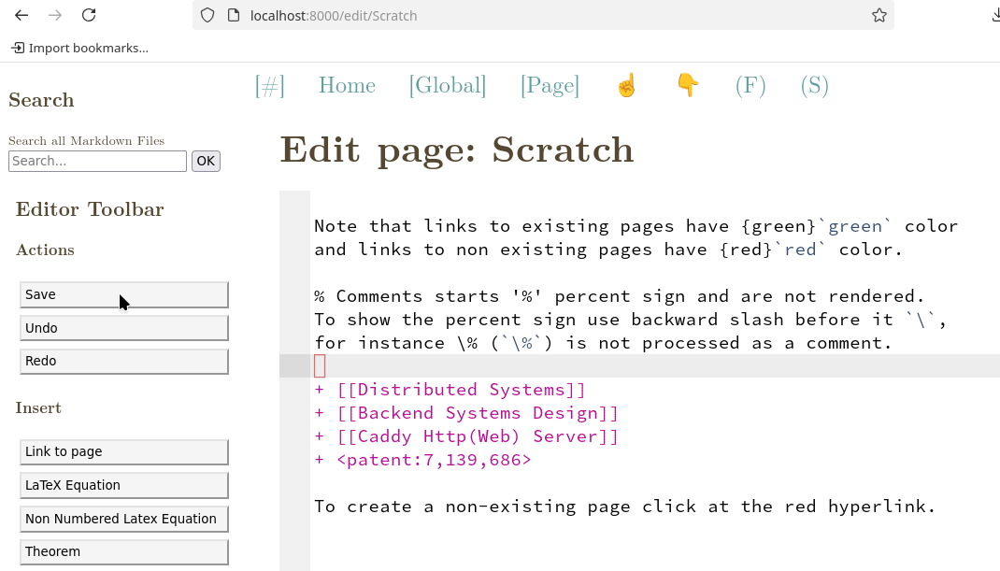

**Copiando e colando imagens**

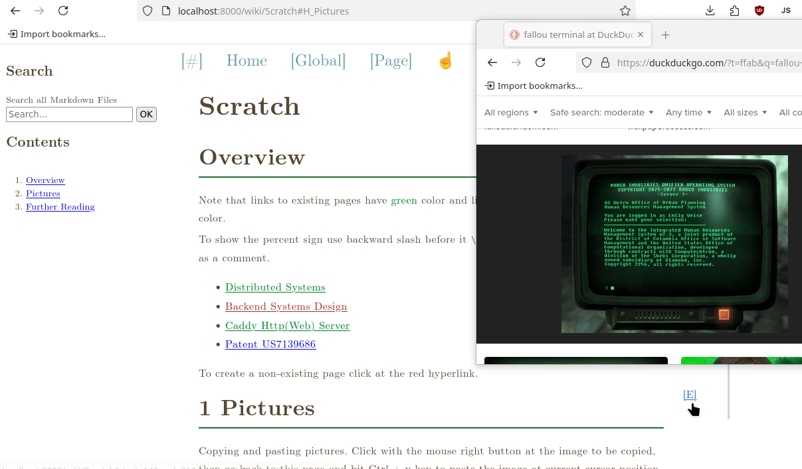

**Recurso de visualização do Markdown**

+ O botão de visualização do editor permite visualizar a aparência de uma página wiki antes de salvá-la. O recurso de visualização também permite visualizar a aparência de um texto Markdown selecionado antes de salvá-lo.

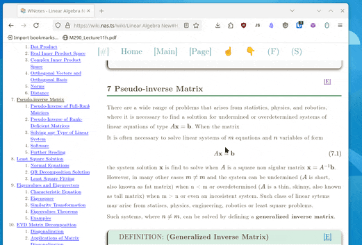


### Capturas de Tela (Screenshot)

**Captura de Tela 1 do Wiki**

Esta página do Wiki, cujo URL relativo é /wiki/Linear%20Algebra%20New, é gerada pelo processamento do arquivo 'Linear Algebra New.md'.

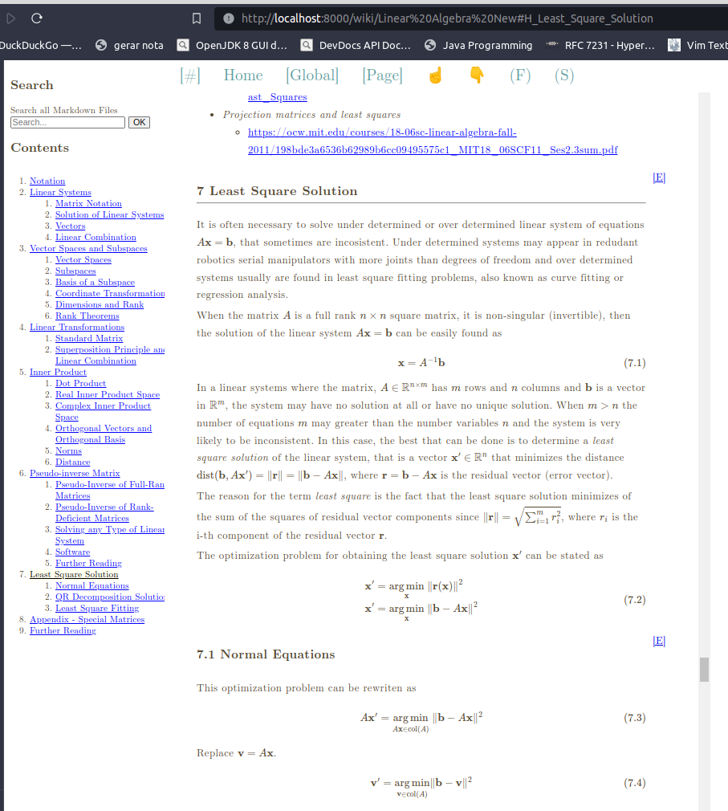

**Captura de Tela 2 do Wiki**

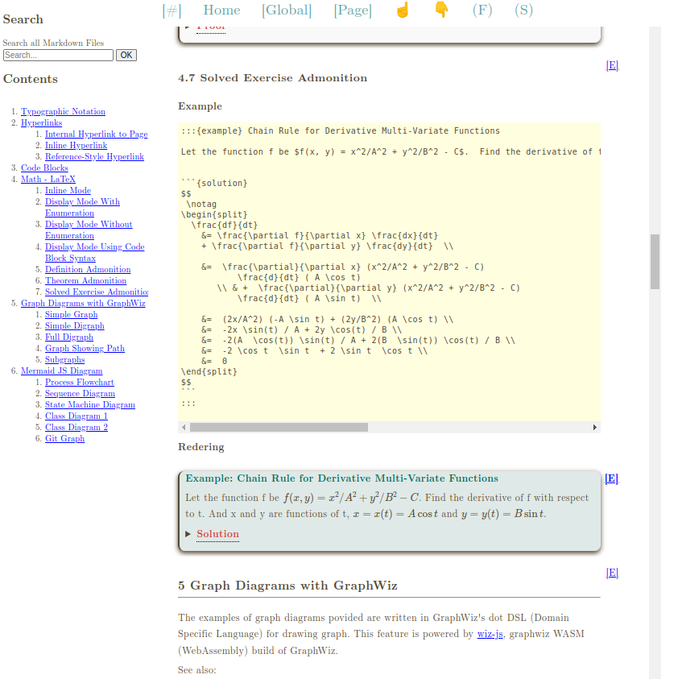

**Captura de Tela 3 do Wiki**

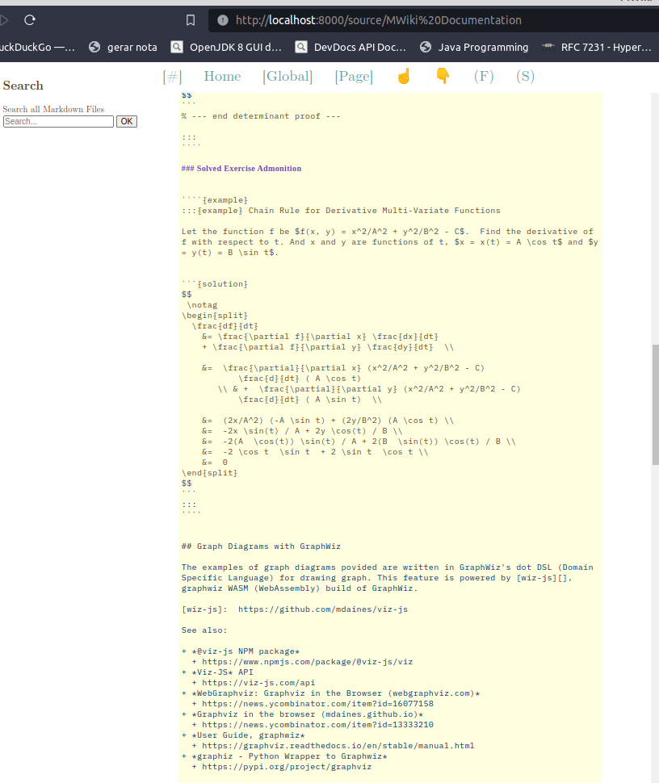

**Captura de Tela 4 do Wiki**

Editor de código MWiki com tecnologia Javascript Ace9.

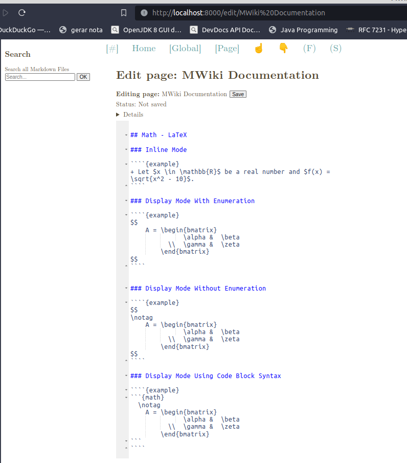

**Captura de Tela 5 do Wiki**

Página de configurações do MWiki.

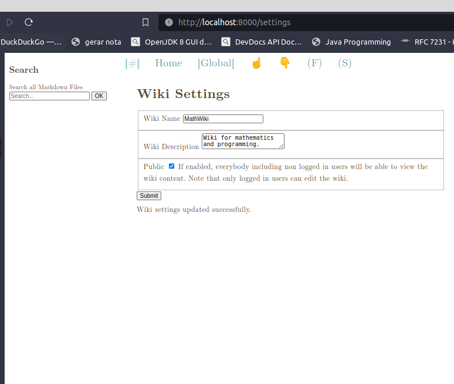

**Captura de Tela 6 do Wiki**

Captura de tela do menu global.

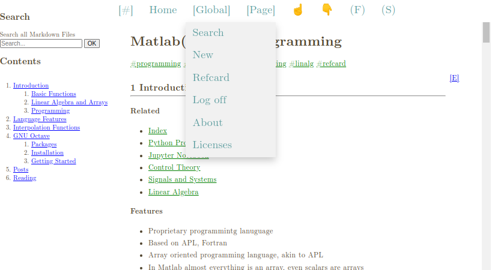

**Captura de tela 7 do Wiki**

Captura de tela do menu de páginas que permite executar ações na página atual do Wiki.

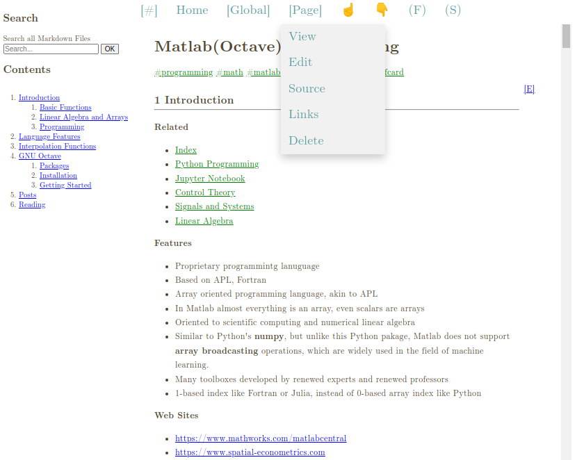

**Captura de tela 8 do Wiki**

É possível ocultar todos os títulos do Wiki para uma navegação rápida em dispositivos móveis ou desktop clicando no botão "(F)" na barra de navegação superior.

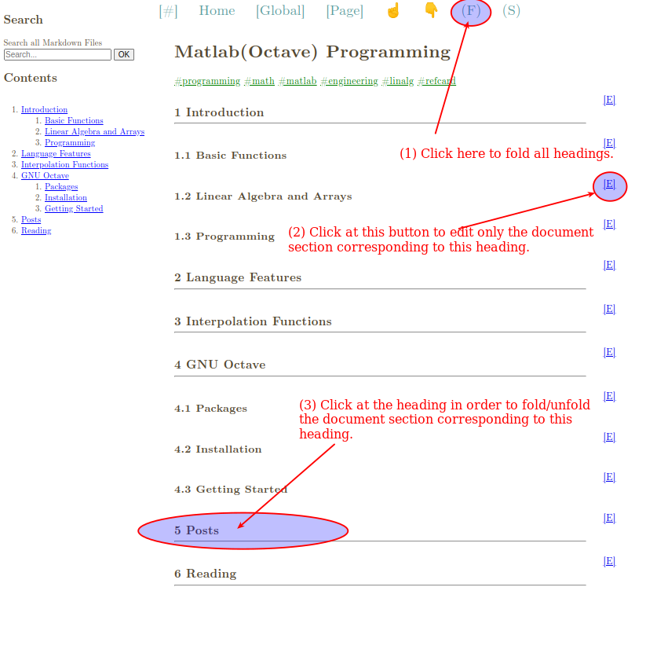

**Captura de tela 9 do Wiki**

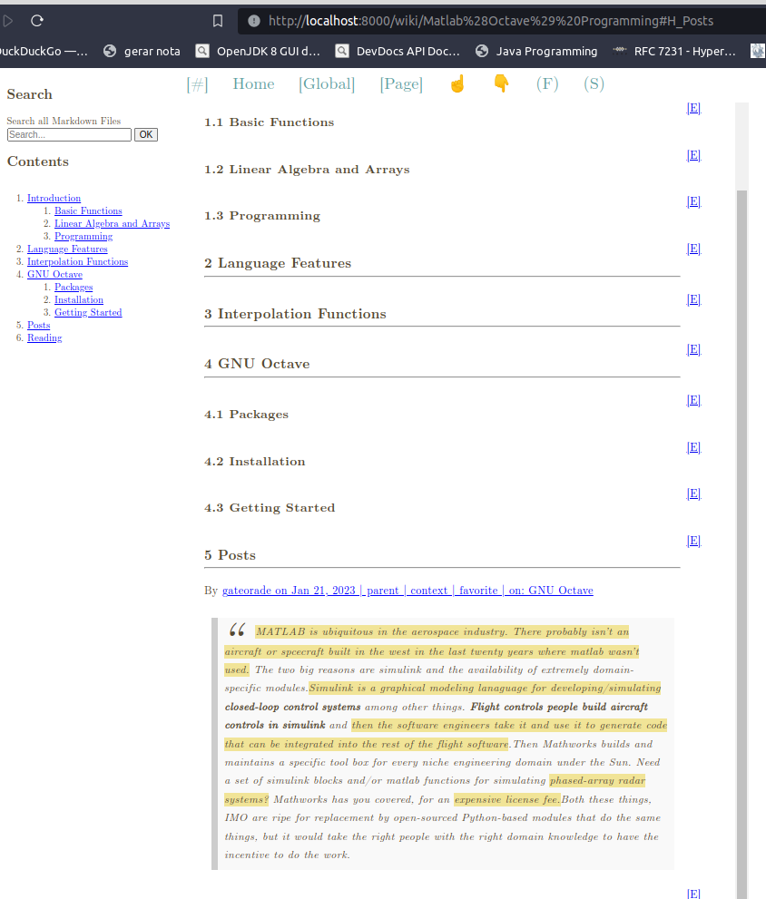

**Captura de tela 10 do Wiki**

O Wiki possui um mecanismo de busca integrado que permite a busca por palavras-chave em todos os arquivos Markdown usados ​​para renderizar as páginas do Wiki.

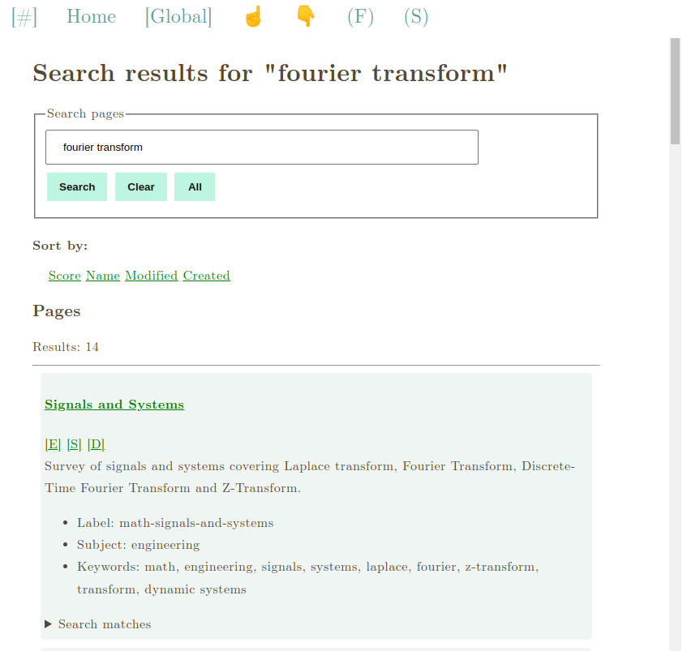

**Captura de Tela 11 do Wiki - Cartão de Referência**

Este wiki fornece uma janela pop-up de cartão de referência que fornece exemplos da linguagem de marcação MWiki (markdown personalizado).

(1) Abra o cartão de referência.

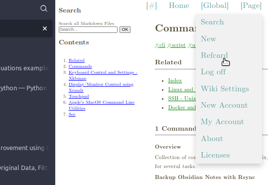

(2) Cartão de referência com todas as seções dobradas.

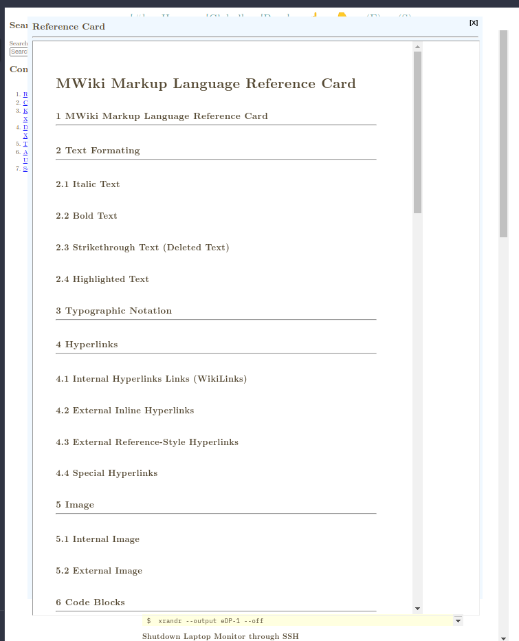

(3) Cartão de referência com uma seção desdobrada.


## Instalação

### Instalação usando o gerenciador de pacotes UV (1)

[UV](https://github.com/astral-sh/uv) é um gerenciador de pacotes para Python extremamente rápido e recente, que pode até instalar várias versões específicas do interpretador Python sem interromper a instalação do Python usada pelo sistema. O UV também pode instalar ferramentas Python em ambientes isolados sem quebrar a instalação atual do Python.

**PASSO 1**

Instalar versão instável *(Unstable Release)*.

```sh
$ uv tool install git+https://github.com/caiorss/mwiki
... ... ... ... ... ... ... ..
Instalou 2 executáveis: mwiki, mwiki-convert
```

Instalar a versão estável mais recente: versão v0.2

```sh
$ uv tool install https://github.com/caiorss/mwiki/archive/refs/tags/v0.2.zip
```

Instalar a versão estável mais recente (usando o hash do commit que não tem como ser mudado após o commit ser publico): versão v0.2

```
$ uv tool install https://github.com/caiorss/mwiki/archive/1a3388679af0a6abaec83f6a88415b617e580c83.zip
```

Instalar a versão de lançamento v0.1

```sh
$ uv tool install https://github.com/caiorss/mwiki/archive/refs/tags/v0.1.zip
```


**PASSO 2** Execute o arquivo/ficheiro executável mwiki:


```sh
$ mwiki 

Usage: mwiki [OPTIONS] COMMAND [ARGS]...

Options:
  --help  Show this message and exit.

Commands:
  compile  Compile Latex Formulas of .md file or folder to SVG images.
  convert  Convert from org-mode markup to markdown
  manage   Manage MWiki settings, including accounts, passwords and etc.
  server   Run the mwiki server.
```

**Inspecionar Arquivos/Ficheiros Executáveis**

```sh
$ which mwiki
/home/username/.local/bin/mwiki

$ whereis mwiki
mwiki: /var/home/username/.local/bin/mwiki

$ file $(which mwiki)
/home/username/.local/bin/mwiki: symbolic link to /home/username/.local/share/uv/tools/mwiki/bin/mwiki

$ file $(readlink $(which mwiki))
/home/username/.local/share/uv/tools/mwiki/bin/mwiki: Python script, ASCII text executable
```

**Desinstalar**

```sh
$ uv tool uninstall mwiki 
Uninstalled 2 executables: mwiki, mwiki-convert
```

### Instalação usando o gerenciador de pacotes UV (2)

Este procedimento de instalação utiliza o gerenciador de pacotes UV para instalar a partir do código-fonte em vez da URL do GitHub.

**PASSO 1:** Clone o repositório.

```sh
$  git clone https://github.com/caiorss/mwiki 
```

Entre no diretório do código-fonte.

```sh
$ cd mwiki
```

**PASSO 2:** Instalar MWIKI usando UV.

```sh
$ uv tool install . 

Resolved 36 packages in 1.07s
Installed 36 packages in 119ms
 + blinker==1.9.0
 + cachelib==0.13.0
 + cffi==1.17.1
 + click==8.1.8
 + cryptography==45.0.4
 + flask==3.1.1
 + flask-session==0.8.0
 + flask-sqlalchemy==3.1.1
 + flask-wtf==1.2.2
 + frontmatter==3.0.8
 + greenlet==3.2.3
 + importlib-metadata==8.7.0
 + itsdangerous==2.2.0
 + jinja2==3.1.6
 + linkify-it-py==2.0.3
 + markdown-it-py==3.0.0
 + markupsafe==3.0.2
 + mdit-py-plugins==0.4.2
 + mdurl==0.1.2
 + msgspec==0.19.0
 + mwiki==0.1 
 + pillow==11.2.1
 + pycparser==2.22
 + pygments==2.19.2
 + python-dateutil==2.9.0.post0
 + pyyaml==5.1
 + six==1.17.0
 + sqlalchemy==2.0.41
 + tomli==2.2.1
 + typing-extensions==4.14.0
 + uc-micro-py==1.0.3
 + waitress==3.0.2
 + watchdog==6.0.0
 + werkzeug==3.1.3
 + wtforms==3.2.1
 + zipp==3.23.0
Installed 2 executables: mwiki, mwiki-convert

```

**Desinstalar**


```sh
$ uv tool uninstall mwiki 
Uninstalled 2 executables: mwiki, mwiki-convert
```


### Instalação usando o gerenciador de pacotes Pipx

**PASSO 1:** Presume-se que Pip e Python já estejam instalados.

```sh
$ pip install pipx 
```

**PASSO 2:** Instalar usando Pipx

Instale o Mwiki usando Pipx (o MWiki requer Python >= 3.9)


```sh
$ pipx install git+https://github.com/caiorss/mwiki 
  installed package mwiki 0.1, installed using Python 3.9.19
  These apps are now globally available
    - mwiki
    - mwiki-convert
    - mwiki_convert
done! ✨ 🌟 ✨

```

Instale o Mwiki usando o Pipx e uma versão diferente do Python. Este comando é útil se a versão padrão do Python no sistema atual for 3.8 ou uma versão não suportada.


```
$ pipx install --python=3.9 git+https://github.com/caiorss/mwiki 
```


### Instalação usando Docker

O Docker é a maneira mais confiável de instalar aplicativos Python, pois é reproduzível e ajuda a evitar o problema das dependências entre Python e Pip (também conhecido como "problema de execução na máquina").

**PASSO 1:** Clonar o repositório

```sh 
$ git clone https://github.com/caiorss/mwiki mwiki

# Enter source code directory
$ cd mwiki
```

**PASSO 2:** Crie a imagem do docker.

```sh
$ docker build --tag mwiki-server .
```

ou execute o Makefile (suportado apenas em sistemas do tipo Unix com GNU Make)

```sh
$ make docker 
```

**PASSO 3:** Execute a imagem do Docker do MWiki. A variável de ambiente $WIKIPATH é definida para qualquer diretório que contenha arquivos Markdown, incluindo os cofres Obsidian.

Crie um arquivo .env no diretório atual contendo a configuração inicial do MWiki passada como variáveis ​​de ambiente. (Opcional)

Arquivo: .env

```
MWIKI_ADMIN_PASSWORD=u2afb5ck69
MWIKI_SITENAME=WBook
WIKI_PUBLIC=
```

Execute o docker passando o arquivo de configuração .env.


```sh
$ docker run --rm -it  --privileged \
            --network=host --env-file=$PWD/.env \
            --volume="$WIKIPATH:/wiki" mwiki-server
 [TRACE] Admin user created OK
 [INFO] Enter the username: admin and password: 'SN81N87JZ6' to log in.
[2025-01-09 20:00:40 +0000] [1] [INFO] Starting gunicorn 23.0.0
[2025-01-09 20:00:40 +0000] [1] [INFO] Listening at: http://0.0.0.0:9090 (1)
[2025-01-09 20:00:40 +0000] [1] [INFO] Using worker: sync
[2025-01-09 20:00:40 +0000] [7] [INFO] Booting worker with pid: 7
[2025-01-09 20:00:40 +0000] [8] [INFO] Booting worker with pid: 8
[2025-01-09 20:00:40 +0000] [9] [INFO] Booting worker with pid: 9
[2025-01-09 20:00:40 +0000] [10] [INFO] Booting worker with pid: 10
[2025-01-09 20:00:40 +0000] [11] [INFO] Booting worker with pid: 11
[2025-01-09 20:00:40 +0000] [12] [INFO] Booting worker with pid: 12
[2025-01-09 20:00:40 +0000] [13] [INFO] Booting worker with pid: 13
[2025-01-09 20:00:40 +0000] [14] [INFO] Booting worker with pid: 14
[2025-01-09 20:00:40 +0000] [15] [INFO] Booting worker with pid: 15
 [TRACE] _username = admin ; _password = SN81N87JZ6
 [WARNING] Note implemented html rendering for foot_note_block =  SyntaxTreeNode(footnote_ref)
 [WARNING] Note implemented html rendering for foot_note_block =  SyntaxTreeNode(footnote_block)

```

Executar como um daemon (serviço em segundo plano desacoplado do terminal):


```sh
$ docker run --detach \
           --name=mwiki  \
           --network=host \
           --env-file=$PWD/.env \
           --privileged \
           --volume="$PWD/pages:/wiki" mwiki-server
a6f0838f5159ff75aa25228fafdbd2f4fe1432c3359a9dc5d3ec84b10d801577
 
```

Ver logs do contêiner mwiki:

```sh
$ docker logs -f mwiki
[2025-01-09 20:06:23 +0000] [1] [INFO] Starting gunicorn 23.0.0
[2025-01-09 20:06:23 +0000] [1] [INFO] Listening at: http://0.0.0.0:9090 (1)
[2025-01-09 20:06:23 +0000] [1] [INFO] Using worker: sync
[2025-01-09 20:06:23 +0000] [7] [INFO] Booting worker with pid: 7
[2025-01-09 20:06:23 +0000] [8] [INFO] Booting worker with pid: 8
[2025-01-09 20:06:23 +0000] [9] [INFO] Booting worker with pid: 9
[2025-01-09 20:06:23 +0000] [10] [INFO] Booting worker with pid: 10
[2025-01-09 20:06:23 +0000] [11] [INFO] Booting worker with pid: 11
[2025-01-09 20:06:23 +0000] [12] [INFO] Booting worker with pid: 12
[2025-01-09 20:06:23 +0000] [13] [INFO] Booting worker with pid: 13
[2025-01-09 20:06:23 +0000] [14] [INFO] Booting worker with pid: 14
[2025-01-09 20:06:24 +0000] [15] [INFO] Booting worker with pid: 15

```

Parar o contêiner MWiki:

```
$ docker stop mwiki 
mwiki
```

Iniciar contêiner MWiki


```sh
$ docker start mwiki 
```

Reinicie o software contêiner MWiki.


```sh
$ docker restart mwiki
```

Alterar o nome do site usando a CLI (Interface de Linha de Comando) integrada/nativa.

```sh
$ docker exec -it mwiki python -m mwiki  manage --sitename=WNotes
 [*] Site name changed to: WNotes
```

Alterar senha do administrador.

```sh
$ docker exec -it mwiki python -m mwiki  manage --admin-password=somePassNewPassword
```

**PASSO 5:**

Abra o MWiki no navegador web, na porta 8080, copiando e colando a URL http://localhost:8000 e digite "admin" no campo de nome de usuário e a senha inicial do administrador no campo de senha. A senha inicial do administrador foi fornecida na saída do comando anterior. A senha é "0JAJ6UAMUA", que é uma string gerada aleatoriamente e exclusiva para cada instalação do MWiki.

**PASSO 6:**

Abra a página de configurações http://localhost:8000/admin e altere as configurações do Wiki. Em seguida, acesse a URL http://localhost:8000/user e altere a senha do administrador. Observe que as senhas dos usuários nunca são armazenadas em texto simples, elas são sempre armazenadas em formato hash por motivos de segurança.


### Instalação via Docker-Compose ou Podman-Compose

**PASSO 1:** Clonar o repositório

```sh 
$ git clone https://github.com/caiorss/mwiki mwiki

# Enter source code directory
$ cd mwiki
```

**PASSO 2:** Edite o arquivo config.env.


Arquivo: config.env

```sh
# MWiki configuration files 
#----------------------------------#

MWIKI_SERVER_ADDR=mwiki 
MWIKI_SERVER_PORT=9090

# Path to wiki folder, where *.md markdown files, images and other 
# files will be stored.
MWIKI_PATH=./sample-wiki

# Password of main admin
MWIKI_ADMIN_PASSWORD=mypasswd

# Name of the Wiki (Name of the website)
MWIKI_SITENAME=MyNoteBook

# URL which the website is hosted or just domain name 
MWIKI_WEBSITE=localhost sbox.ts 

# Configure MWiki as a private Wiki. 
# => Only logged in users can view wiki pages. 
# MWIKI_PUBLIC=   

# Configure MWiki  as a public Wiki.
# => Anonymous users can view wiki pages, however only 
# admin users can edit.
MWIKI_PUBLIC=true

# Server static files using Caddy or NGinx 
MWIKI_X_ACCEL_REDIRECT=true

#----------------------------------------------------##
##      Less common Settings for certificate         ##
#----------------------------------------------------##
# They are not needed if the server is hosted in a machine
# with static and public IP address. Those settings are only
# required when hosting in internal networks (LANs).
#
MWIKI_INTERNAL_CA=
MWIKI_ACME_CA_URL=
```

**PASSO 3:** Execute docker-compose ou podman compose para por o sistem no ar (online).

por o sistem no ar (online) com docker-compose.

```sh
$ docker-compose --env-file=./config.env up -d 
```

Por o sistem no ar (online).

```sh
$ podman-compose --env-file=./config.env up -d 
```

**PASSO 4:** Certificados TLS/SSL

Se o MWiki estiver hospedado em uma máquina com endereço IP estático e público acessível de qualquer lugar na internet e o domínio MWiki apontar para esse endereço IP, o Caddy obterá automaticamente o certificado TLS/SSL da Autoridade Certificadora Let's Encrypt CA.

Se este aplicativo estiver hospedado em uma rede local ou VPN site a site, como tailscale, e não for possível usar a Autoridade Certificadora Let's Encrypt CA, o Caddy pode ser transformado em uma Autoridade Certificadora CA local editando o arquivo config.env e alterando


```
MWIKI_INTERNAL_CA=true
```

Esta etapa cria uma URL

+ `https://<mwiki-website-domain>/root.crt`

onde o usuário pode baixar o certificado da CA raiz e instalá-lo em navegadores da web ou celulares. Este certificado da CA raiz pode ser baixado usando o curl. Este procedimento é útil para auto-hospedar o MWiki em laboratórios domésticos.

```sh
$ curl -O -k --silent https://<mwiki-website-domain>/root.crt
```

Veja também:

+ *Set up Certificate Authorities (CAs) in Firefox*
  + https://support.mozilla.org/en-US/kb/setting-certificate-authorities-firefox
+ *Installing a Root Certificate Authority in Firefox* 
  + https://chewett.co.uk/blog/854/installing-root-certificate-authority-firefox/
+ *How to Add a Certificate on Android? Step by Step*
  + https://www.airdroid.com/mdm/add-certificate-android/


## Software e ferramentas complementares 

O seguinte conjunto de softwares ou aplicativos complementares são recomendados para o MWiki, pois podem fornecer recursos adicionais e melhorar o uso.

**Motores de Busca (Buscadores)**

+ https://noai.duckduckgo.com 
  + Motor de busca *(search engine)* sem resumo de IA falso e enganoso.

**Ferramentas Online**

+ *QuickLatex* 
  + https://www.quicklatex.com 
  + Esta ferramenta online permite visualizar e renderizar rapidamente expressões matemáticas LaTeX sem precisar instalar nada.
+ *Table Generator for Markdown, LaTeX and MediaWiki*
  + https://www.tablesgenerator.com
+ *Detexify*
  + https://detexify.kirelabs.org/classify.html
  + *Mostra código LaTeX para escrever símbolo matemático desenhado manualmente seja com o mouse/cursor ou com o dedo em navegadoes de dispositivos móveis.*
+ *LaTeX Equation Editor*  
  + https://editor.codecogs.com
+ *Mathcha.io*
+ https://www.mathcha.io
+ *Ferramenta online para desenho de ilustrações científicas/técnicas, que suporta símbolos LaTeX e possui vários blocos de construção para desenhar diagramas ou esquemas geométricos, elétricos, mecânicos e de ciência da computação.
+ *How to write algorithm in Latex*
  + https://shantoroy.com/latex/how-to-write-algorithm-in-latex
+ *LaTeX/Algorithms - Wikibooks*
  + https://en.wikibooks.org/wiki/LaTeX/Algorithms

**Complementos/extensões do Navegadores Web**

+ *LibreWolf* - Fork (versão modificada) do navegador Firefox
    + https://librewolf.net/
    + *Navegador Firefox modificado e reforçado para maior segurança, privacidade e proteção contra rastreamento.*
+ *Obsidian Web Clipper* (Addon do Firefox)* \[MELHOR\]
    + https://addons.mozilla.org/en-US/firefox/addon/web-clipper-obsidian
    + Extensão que permite aos usuários salvar páginas da web em formato markdown ou transformar partes selecionadas da página em markdown. Esta ferramenta pode ser usada com o MWiki para extrair informações de páginas da web, já que a linguagem de marcação MWiki é compatível com o markdown Obsidian.
+ *Web Archive* - Busca por versões mais antigas do URL atual do Win Web Archiver, archive.is e outros sites.
    + https://addons.mozilla.org/en-US/firefox/addon/view-page-archive/
    + *Visualize versões arquivadas e em cache de páginas da web em vários mecanismos de busca, como Wayback Machine e Archive․is.*
+ *Permitir Clique com o Botão Direito - Reative o clique com o botão direito em sites que o sobrescrevem* (Firefox)
    + https://addons.mozilla.org/en-US/firefox/addon/re-enable-right-click/
    + *A extensão "Permitir Clique com o Botão Direito" modifica alguns métodos do JavaScript para habilitar o menu de contexto original do botão direito quando uma página da web bloqueia intencionalmente o clique com o botão direito em seu conteúdo. A maioria dos navegadores modernos permite que o JavaScript desabilite o menu de contexto padrão quando uma página da web fornece seu próprio menu de contexto personalizado para seu conteúdo (como no Google Docs). No entanto, esse recurso também pode permitir que proprietários de sites desabilitem o menu de contexto do botão direito sem fornecer nenhuma funcionalidade útil. A extensão adiciona um botão à área da barra de ferramentas do navegador do usuário. Clicar no ícone da extensão injeta um pequeno script na página atual para remover o bloqueio do menu de contexto. É importante observar que a extensão não injeta nenhum código por padrão em nenhuma página da web; ela só o faz mediante ação do usuário. Os usuários podem clicar no botão da extensão para liberar a restrição quando um site bloqueia o menu de contexto do botão direito sem oferecer um menu de contexto personalizado.* (Sem Script, Desativar JS, NOTA: Traduzido da descrição original em inglês.) 
+ *Script Blocker Ultimate*  
    + https://addons.mozilla.org/en-US/firefox/addon/script-blocker-ultimate/
    + *Extensão para alternar a execução de Javascript, que permite desativar e ativar JavaScript.*
+ *Árvore de Tabs para Firefox* (melhor navegação em muitas tabs)
    + https://addons.mozilla.org/en-US/firefox/addon/tree-style-tab


**Tradução e Conversão de Texto em Fala**

+ *Speech Note - Flathub* \[Aplicativo Flatpak Linux\] (Tradutor "G00gl3" Offline)
    + https://flathub.org/apps/net.mkiol.SpeechNote
    + Resumo: *O Speech Note permite que você faça, leia e traduza notas em vários idiomas. Ele utiliza Conversão de Texto em Fala, Conversão de Texto em Fala e Tradução Automática para isso. O processamento de texto e voz ocorre totalmente offline, localmente no seu computador, sem usar uma conexão de rede. Sua privacidade é sempre respeitada. Nenhum dado é enviado para a internet.*
    + NOTA: Requer uso de GPU, o software tem melhor performance/desempenho com GPUs da NVIDIA com CUDA.
    + AVISO: Ferramentas de tradução automatizada de texto baseiam-se na probabilidade de palavras, assim como os tão badalados LLM (Modelos de Grandes Linguagens). Como resultado, elas podem não ser capazes de traduzir com precisão gírias, jargões, ditados populares e nuances linguísticas. Além disso, elas têm maior probabilidade de falhar em idiomas distantes das línguas europeias e do inglês. Também vale a pena notar que algumas variedades linguísticas ou dialetos, como o dialeto alemão da Baviera, podem existir principalmente na forma falada e, infelizmente, não existir em quantidade significativa na forma escrita, o que dificulta a tradução das informações por ferramentas automatizadas.


**Ferramentas de Captura de Tela**

Observação: Essas ferramentas permitem tirar capturas de tela de uma parte selecionada da tela e colá-las no aplicativo de destino ou no editor MWiki pressionando Ctrl + v.

- *Spetacle* \[MELHOR\]
    + https://apps.kde.org/spectacle/
    + *Ferramenta do KDE Plasma para tirar capturas de tela. Também permite selecionar áreas retangulares da tela e adicionar textos e anotações. Este aplicativo está disponível em qualquer distribuição Linux com ambiente de trabalho KDE Plasma.*
- *Flameshot*
    + https://flameshot.org
    + *Ferramenta de captura de tela multiplataforma disponível para Microsoft Windows, distribuições Linux e MacOSX da Apple.*
- *Flameshot - Flatpak*
    + https://flathub.org/apps/org.flameshot.Flameshot
- *KSnip - Flathub* (Aplicativo Flatpak KDE/QT)
    + https://flathub.org/apps/org.ksnip.ksnip
    + *Ksnip é uma ferramenta de captura de tela multiplataforma baseada em Qt que oferece diversos recursos de anotação para suas capturas de tela.*
- *Ferramenta de Captura de Tela do Shutter* \[MELHOR\]
    + https://shutter-project.org
    + => Observação: Nota disponível como AppImage ou aplicativo flatpak. É mais fácil instalar o Shutter em distribuições Linux baseadas em Debian ou Ubuntu.

**Gravador de Vídeo**

+ *Peek - Flathub* (Gravador de Tela - pode criar animações GIF ou vídeos WebM e MP4)
    + https://flathub.org/apps/com.uploadedlobster.peek
    + Resumo: * O Peek facilita a criação de screencasts curtos de uma área da tela. Ele foi desenvolvido para o uso específico de gravação de áreas da tela, por exemplo, para mostrar facilmente os recursos de interface dos seus próprios aplicativos ou para mostrar um bug em relatórios de bugs. Com o Peek, basta posicionar a janela do Peek sobre a área que deseja gravar e clicar em "Gravar". O Peek é otimizado para gerar GIFs animados, mas você também pode gravar diretamente em WebM ou MP4, se preferir.*

**Ferramentas de Orquestração de Contêineres**

+ *Docker Compose*, Documentação Oficial da Docker Company
    + https://docs.docker.com/compose/
+ *Podman Compose*, Red Hat
    + https://docs.podman.io/en/latest/markdown/podman-compose.1.html 


**VPN Mesh Site-to-Site (Virtual Private Network / Rede Privada Virtual)**


Uma VPN Mesh Site-to-Site, como a **tailscale**, pode ser útil para hospedar este aplicativo em uma rede local privada e acessá-lo de qualquer lugar do mundo sem expor nenhuma porta TCP ou UDP à internet.

+ *Tailscale* - Site Oficial
    + https://tailscale.com
    + Observação: Apenas alguns clientes Tailscale são de código aberto. O servidor Tailscale padrão fornecido como SAAS (Software como Serviço) não é de código aberto, embora exista a implementação de código aberto **Headscale** do servidor Tailscale.
+ *Download do Cliente Tailscale*
    + https://tailscale.com/download
+ *Cliente Tailscale para Android na App Store do F-Droid* (App Store para aplicativos Android de código aberto compilados com build reproduzível)
    + https://f-droid.org/packages/com.tailscale.ipn
+ *Servidor Headscale* (código aberto, adequado para homelabs e auto-hospedagem)
    + https://headscale.net/stable
+ *Servidor Headscale - Repositório Github* (Escrito em GO - Golang)
    + https://github.com/juanfont/headscale

## Leitura Adicional 

+ *If it is worth keeping, save it in Markdown*
  + https://p.migdal.pl/blog/2025/02/markdown-saves
+ *Scientific Articles*, MyST 
  + https://mystmd.org/guide/quickstart-myst-documents
+ *R Markdown* 
  + https://rmarkdown.rstudio.com/
  + *R Markdown documents are fully reproducible. Use a productive notebook interface to weave together narrative text and code to produce elegantly formatted output. Use multiple languages including R, Python, and SQL.*
+ *MyST syntax cheat sheet*, Jupyter Book
  + https://jupyterbook.org/en/stable/reference/cheatsheet.html
  + NOTE: MWiki syntax is mostly compatible with MyST syntax because it uses the same markdown parser developed by Jupyter Book project. Credits should be given to MyST markdown project.
+ *Working with MyST Markdown*, MyST 
  + https://mystmd.org/guide/quickstart-myst-markdown
+ *Export Static Documents*, MyST 
  + https://mystmd.org/guide/quickstart-static-exports
+ *Try MyST*, MyST 
  + https://mystmd.org/sandbox
+ *CommonMark*, MyST 
  + https://mystmd.org/guide/commonmark
+ *CommonMark Spec*, CommonMark
  + https://spec.commonmark.org/0.31.2/#introduction
+ *reStructuredText* (Python RST syntax)
  + https://docutils.sourceforge.io/rst.html
+ *Documentation Audiences*, OpenEdx
  + <https://docs.openedx.org/en/latest/documentors/concepts/about_doc_audiences.html>