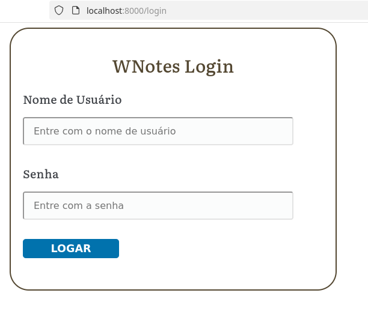
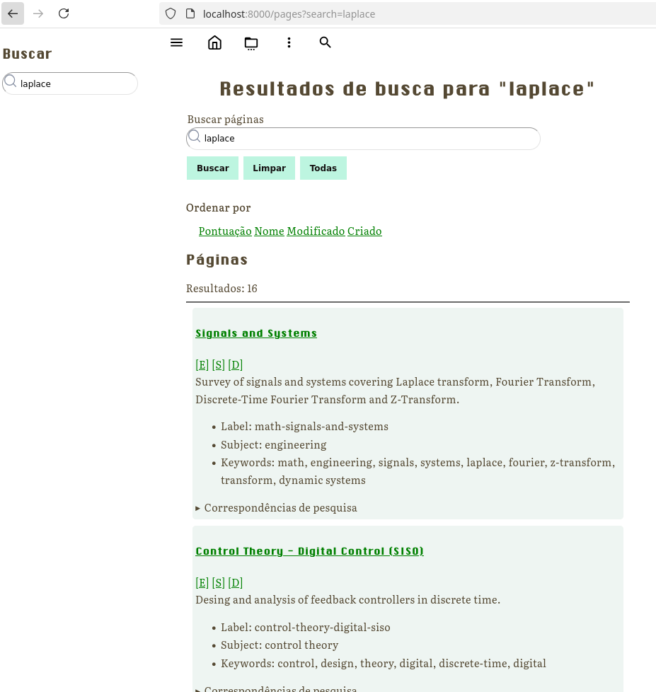
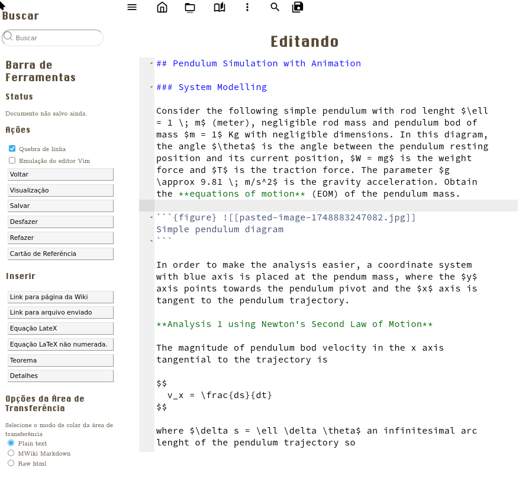

# MWiki - Wiki impulsionada por Markdown

## Visão Geral

O MWiki é um **motor wiki** e um aplicativo web para anotações voltado para matemática e pesquisa, projetado para comunicação científica e técnica. Este software wiki possui uma linguagem de marcação leve e semanticamente rica, baseada em MyST Markdown, Obsidian Markdown e na linguagem de marcação do MediaWiki. O aplicativo também inclui um gerador de sites estáticos, que pode exportar notas ou páginas do MWiki para sites estáticos ou arquivos HTML independentes para leitura offline, semelhantes a arquivos PDF.

Este aplicativo Python é suportado pelo framework web Python Flask e pelo parser extensível Markdown-it usado pelo MyST Markdown e pelo projeto Jupyter Book.

Aplicações:
+ Documentação
+ Redação Técnica/Científica, especialmente nas áreas STEM (Ciências, Tecnologia, Engenharia e Matemática).
+ Base de Conhecimento Pessoal
+ Preservação do Conhecimento e da Informação


**Registro de Mudanças (Changelog):**

+ [changelog.md](../changelog.md)


**NOTAS:**

+ Observação: Este software ainda está **em progresso** e em estágio inicial. No entanto, ele já pode ser usado como um aplicativo de anotações pessoais.
+ Observação: o Mediawiki é o software de motor wiki usado pela Wikipédia.


### Destaques de Funcionalidades

#### Funcionalidades Wiki

+ Wiki baseado em arquivo: todas as páginas Wiki são armazenadas como arquivos Markdown, como o motor wiki Moin Moin e o Dokuwiki. No entanto, ele usa um banco de dados de arquivos SQLite ou qualquer banco de dados completo para fins de gerenciamento do sistema.
+ Equações LaTeX com vários estilos de enumeração, renderizadas com MathJax ou KaTeX (renderização mais rápida, mas o uso do KaTeX ainda é experimental).
+ Hiperlinks de referência cruzada para equações LaTeX usando `\label{EquationLabel}` e `\eqref{EquationLabel}`. Este recurso é compatível com os mecanismos de renderização MathJax e KaTeX.
+ Suporte para macros LaTeX específicas de página e macros LaTeX globais para mecanismos de renderização MathJax ou KaTeX.
+ Pesquisa de texto completo *(full text search)* que permite consultas de pesquisa complexas semelhantes aos mecanismos/motores de busca da web.
+ Suporta MyST Markdown, GFM (Github-Flavored Markdown Support), subconjunto da sintaxe Obsidian Markdown, subconjunto da linguagem de marcação Mediawiki e HTML embutido.
+ Páginas escritas em linguagem de marcação baseada em Markdown em vez de HTML, o que permite que qualquer pessoa não programadora escreva documentos científicos e técnicos que são renderizados em HTML.
+ Botões para editar seções específicas do documento, semelhantes aos botões de edição de seções do Mediawiki.
+ Upload de arquivo. Agora, o editor de código wiki possui um botão para inserir um hiperlink para um arquivo carregado. Ao clicar no botão, uma janela pop-up para upload é exibida. Assim que o usuário envia o arquivo, a janela é fechada e um link para o arquivo é inserido no editor.
+ Páginas embutiveis. O conteúdo de uma página wiki pode ser incorporado em outra página wiki usando a sintaxe `![[Nome da página Wiki a ser incorporada]]`
+ Visualização do documento - permite que os usuários visualizem como o texto em markdown de uma página wiki ficará quando renderizado antes de salvá-lo. O botão de pré-visualização do editor também permite visualizar a aparência de um código markdown selecionado de uma página wiki quando renderizado.
+ Interface do usuário com suporte para **internacionalização** (i18N) e **localização (i10N)**. O idioma padrão da interface do usuário pode ser alterado nas configurações do formulário. Por enquanto, apenas os idiomas inglês (inglês internacional com ortografia americana) e português (português do Brasil) estão disponíveis. No entanto, novos idiomas ou localidades podem ser adicionados sem alterar a base de código.
+ Dependências JavaScript de terceiros para uso offline. Por exemplo, o MWiki possui MathJax, pseudocode-JS e Ace9 embutidos *(vendored)* no código-fonte para uso offline, mesmo quando não há CDN disponível devido à falta de conectividade com a internet ou se o Wiki for usado em um ambiente restrito protegido por firewall.

#### Controle de acesso

+ O Wiki possui os seguintes tipos de usuários: *admin*, que pode editar as páginas do Wiki; *guest* (visitante), um usuário registrado que pode visualizar páginas mesmo que o Wiki não seja público, mas um usuário convidado não pode editar nenhuma página; e usuários *anonymous* (anônimos - usuários não logados/autenticados) que só podem visualizar páginas se a caixa de seleção **público** nas configurações do Wiki (páginas '/settings') estiver habilitada.

+ Configurações do wiki público/privado - se a caixa de seleção **público** na página de configurações do MWiki estiver desabilitada, apenas usuários logados poderão visualizar as páginas do wiki e usuários não logados serão redirecionados para a tela de autenticação. Se esta caixa de seleção estiver habilitada, usuários não logados poderão visualizar o wiki. Observe que: somente usuários do tipo administrador podem editar as páginas do wiki e fazer alterações em qualquer conteúdo.

#### Funcionalidades do Editor de Texto

+ **Editor de código** Markdown desenvolvido sobre o editor de código JavaScript Ace9.
+ *Conversor de área de transferência para Markdown*, que permite converter conteúdo HTML copiado de qualquer outra página da web (também conhecida como site) para Markdown do MWiki. Este recurso é semelhante à cópia e colagem de texto não simples do Obsidian.
+ Carregue imagens colando-as da área de transferência.
+ Uso: Copie qualquer imagem clicando com o botão direito do mouse e cole-a na sessão do editor de texto de alguma página wiki usando o mouse ou pressionando Ctrl + V.
+ NOTA: Os recursos da área de transferência dependem da API HTML5 do Clibpboard, disponível apenas em [contextos seguros](https://developer.mozilla.org/en-US/docs/Web/Security/Secure_Contexts). Portanto, colar imagens da área de transferência para o editor de texto wiki só funciona se o wiki for servido em um host local ou em um domínio com https (HTTP + TLS), o que pode exigir um proxy reverso, como Caddy ou NGinx, para criptografia TLS/SSL e autenticação do servidor.
+ [VIM](<https://en.wikipedia.org/wiki/Vim_(text_editor)>) Atalhos de Tecla do Editor: O editor Wiki usa atalhos de tecla do VIM por padrão.

Veja também:

+ *VIM dot/ponto ORG* - Official Website
  + https://www.vim.org
+ *Vim (text editor)*
  + https://en.wikipedia.org/wiki/Vim_(text_editor)
+ *A Great Vim Cheat Sheet*
  + https://vimsheet.com/
+ *Vim Cheat Sheet*
  + https://vim.rtorr.com
+ *Vim Key Bindings – Vim Keys List Reference*
  + https://www.freecodecamp.org/news/vim-key-bindings-reference/
+ *vi Complete Key Binding List*
  + https://hea-www.harvard.edu/~fine/Tech/vi.html


  #### Linguagem de Markup(Marcação/Formatação) da MWiki

+ Formatação de texto:
+ Texto em itálico
+ Texto em negrito
+ Texto tachado (também conhecido como texto excluído)
+ Texto colorido
+ Abreviação, que corresponde à tag HTML5 `<abbr>`.
+ Texto sobrescrito
+ Texto subscrito
+ Blocos de código com destaque de sintaxe
+ Tabelas
+ Lista
+ Lista com marcadores
+ Listas ordenadas
+ Listas de definições
+ Comunicação científica e técnica
+ Fórmula LaTeX embutida (com tecnologia MathJaX)
+ Fórmula LaTeX embutida (modo de exibição) com enumeração automática
+ Blocos de código especiais para adicionar macros LaTeX personalizadas
+ Bloco de código em pseudocódigo
+ Advertência (também conhecida como caixa de chamada - *admonition*) para definição matemática
+ Advertência para teorema matemático
+ Advertência para exemplos de exercícios resolvidos
+ Seção dobrável para solução de exercícios resolvidos
+ Seção dobrável para provas de teoremas, usada em advertências de teoremas (*theorem admonition*).
+ Advertências
+ Advertência de Dica
+ Advertência de Nota
+ Advertência de Informação
+ Advertência de Aviso
+ Advertência Dobrável

Veja documentação detalhada e exemplos em:

+ [Linguagem de Marcação](./README-Markup-Language.md)


## Atalhos de Teclado (Atalhos de Tecla)

+ NOTA: Não é necessário lembrar dessas combinações de teclas, pois há um botão de menu no menu **[Main]** (principal em inglês), que permite abrir a janela auxiliar de combinações de teclas (atalho) exibindo todas as atalhose de teclados.
+ NOTA: Disponível desde de a versão v0.3.1

| Atalho | Descrição |
| --------- | ------------------------------------------------ |
| ? | Alterna a janela auxiliar de atalhos de teclado. |
| ? | Digite ? Ponto de interrogação novamente para fechar esta janela. |
| Ctrl / | Ir para o formulário de pesquisa. |
| Ctrl e | Alterna para um salto rápido para a página Wiki. |
| Ctrl 1 | Ir para a página de índice '/' URL |
| Ctrl 2 | Ir para /pages - lista de todas as páginas Wiki. |
| Ctrl 3 | Ir para /tags - lista de todas as tags. |
| Ctrl 5 | Alterna os títulos da página Wiki atual. |
| Ctrl 9 | Alterna a exibição de todos os links da página Wiki atual. |


## Demonstração

Uma demonstração de como as páginas do MWiki se parecem pode ser vista em

+ https://caiorss.github.io/mwiki

que é um site estático construído usando o comando $ mwiki do gerador estático MWiki, compilando todos os arquivos markdown *.md da pasta do repositório [./sample-wiki](./sample-wiki) para HTML.

Como esta demonstração é um site estático, ela não possui um formulário de login e outras funções de controle de acesso ao servidor. No entanto, é possível usar todos os recursos do lado do cliente, incluindo a alteração do idioma da interface do usuário.

### Animações GIF

NOTA: Embora as animações GIF estejam desatualizadas devido às principais mudanças no layout e na interface do usuário, as funcionalidades apresentadas permanecem as mesmas.


**Animação GIF mostrando usdo do MWiki**


**Copiando e colando imagens**


**Recurso de visualização do Markdown**

+ O botão de visualização do editor permite visualizar a aparência de uma página wiki antes de salvá-la. O recurso de visualização também permite visualizar a aparência de um texto Markdown selecionado antes de salvá-lo.


### Capturas de Tela (Screenshot)


**Tela de Login (Autenticação, Log in)**

Se o wiki estiver configurado como não público nos formulários de configurações, o usuário será redirecionado para o formulário de autenticação. O redirecionamento para este formulário também ocorre se o usuário tentar acessar qualquer página que exija autenticação. Observe que o nome padrão do site é MWiki. Neste caso, o nome do site é definido como WNotes. Ele pode ser alterado no formulário de login.


Tela de autenticação localizada em Português.




**Captura de Tela 1 do Wiki**

Esta página do Wiki, cujo URL relativo é /wiki/Linear%20Algebra%20New, é gerada pelo processamento do arquivo 'Linear Algebra New.md'.


**Captura de Tela 2 do Wiki**


**Captura de Tela 3 do Wiki**


**Captura de Tela 4 do Wiki**

Editor de código MWiki com tecnologia Javascript Ace9.


A janela de entrada LaTeX é uma janela pop-up que pode ser acessada no editor clicando no botão "Janela de Entrada LaTeX". Qualquer fórmula LaTeX digitada nesta janela é renderizada imediatamente, fornecendo um feedback rápido aos usuários.


Janela de diálogo para inserir emojis e símbolos Unicode. Esta janela oferece diversos emojis e símbolos Unicode, incluindo símbolos matemáticos, moedas, símbolos APL (linguagem de programação orientada a arrays), bandeiras de países e muito mais.


**Captura de Tela 5 do Wiki (Configurações)**

Página de configurações do MWiki.


Página de configurações do MWiki localizada para o português Brasileiro.


**Captura de Tela 6 do Wiki**

Captura de tela do menu principal *(main menu)*.


**Captura de tela 7 do Wiki**

Captura de tela do menu de página *(page menu)*. Nota: este menu esta também disponível em Português como muitas outras telas.


**Captura de tela 8 do Wiki**

É possível ocultar todos os títulos do Wiki para uma navegação rápida em dispositivos móveis ou desktop clicando no botão "(F)" na barra de navegação superior.


**Captura de tela 9 do Wiki**


**Captura de tela 10 do Wiki**

O Wiki possui um mecanismo de busca integrado que permite a busca por palavras-chave em todos os arquivos Markdown usados ​​para renderizar as páginas do Wiki.


Screenshot do motor de buscas *(search engine)* em português.



**Captura de Tela 11 do Wiki - Cartão de Referência**

Este wiki fornece uma janela pop-up de cartão de referência que fornece exemplos da linguagem de marcação MWiki (markdown personalizado).

(1) O cartão de referência pode ser aberto clicando no botão 'Reference Card' na barra de ferramentas do editor.


(1) O cartão de referência pode ser aberto clicando no botão 'Cartão de Referência' na barra de ferramentas do editor se a interface estiver configurada para o português.



(2) Cartão de referência com todas as seções dobradas.


(3) Cartão de referência com uma seção desdobrada.


**Captura de Tela 12 do Wiki**

É possível visualizar equações referenciadas por links, definidos usando `$\eqref{EquationLabel}`, para equações LaTeX rotuladas com `\label{EquationLabel}` sem clicar nos links de referência. Esse recurso torna mais fácil e rápido navegar por equações com referências cruzadas. Note que isso está disponível apenas para o motor de renderização KaTeX.


## Instalação

### Instalação usando o gerenciador de pacotes UV (1)

[UV](https://github.com/astral-sh/uv) é um gerenciador de pacotes para Python extremamente rápido e recente, que pode até instalar várias versões específicas do interpretador Python sem interromper a instalação do Python usada pelo sistema. O UV também pode instalar ferramentas Python em ambientes isolados sem quebrar a instalação atual do Python.

**PASSO 1**

Instalar versão estável  mais recente. NOTA: agora a linha de desenvolvimento mestra *master branch* contém apenas código estável.


```sh
$ uv tool install git+https://github.com/caiorss/mwiki
... ... ... ... ... ... ... ..
  Installed 2 executables: mwiki, mwiki-convert
```

Instalar a versão estável mais recente: versão v0.9.3

```sh
$ uv tool install https://github.com/caiorss/mwiki/archive/refs/tags/v0.9.3.zip
```

Instalar versão estável mais recente v0.9.3 usando o hash de commit (reproduzível e imutável).

```sh
$ uv tool install https://github.com/caiorss/mwiki/archive/7af8d4c77fa0a1c6a48cbcec548d88537b63c039.zip
```

Instalar a versão: v0.92

```sh
$ uv tool install https://github.com/caiorss/mwiki/archive/refs/tags/v0.9.2.zip

# Or

$ uv tool install https://github.com/caiorss/mwiki/archive/aba98a39fa761f0270d328445b731a79c3403ff9.zip
```

Instalar a versão: v0.91

```sh
$ uv tool install https://github.com/caiorss/mwiki/archive/refs/tags/v0.9.1.zip

# Ou

$ uv tool install https://github.com/caiorss/mwiki/archive/2c01584aab00ac709b8714a49a2555231ad9a0eb.zip
```

Instalar a versão: v0.9

```sh
$ uv tool install https://github.com/caiorss/mwiki/archive/refs/tags/v0.9.zip

# Ou

$ uv tool install https://github.com/caiorss/mwiki/archive/a381108846b8044cad5466385de0cae3ee4122e9.zip
```

Instalar a versão: v0.81

```sh
$ uv tool install https://github.com/caiorss/mwiki/archive/refs/tags/v0.8.1.zip

# Ou

$ uv tool install https://github.com/caiorss/mwiki/archive/bbd1f292b7bb2d4c9c2e948ed4d907f525388896.zip
```


Instalar a versão: versão v0.8

```sh
$ uv tool install https://github.com/caiorss/mwiki/archive/refs/tags/v0.8.zip

# out 


$ uv tool install https://github.com/caiorss/mwiki/archive/e2a9fdc11abf0083e06bd5b90ad297c5e8b5d681.zip
```


Instalar a versão: versão v0.7


```sh
$ uv tool install https://github.com/caiorss/mwiki/archive/refs/tags/v0.7.zip

#or

$ uv tool install https://github.com/caiorss/mwiki/archive/846468ff566248b88a20ae5ab93073d20443e889.zip
```


Instalar a versão: versão v0.6

```sh
$ uv tool install https://github.com/caiorss/mwiki/archive/refs/tags/v0.6.zip

## Ou

$ uv tool iinstall https://github.com/caiorss/mwiki/archive/cb5d6855890d218d18d142447c0b562b6ef3afb3.zip
```


Instalar a versão: versão v0.51

```sh
$ uv tool install https://github.com/caiorss/mwiki/archive/refs/tags/v0.5.1.zip

## Or

$ uv tool install https://github.com/caiorss/mwiki/archive/239eeab1a5e52ec7ed8ad941866bb3292052fa09.zip
```

Instalar a versão: versão v0.5


```sh
$ uv tool install https://github.com/caiorss/mwiki/archive/refs/tags/v0.5.zip

## Or

$ uv tool install https://github.com/caiorss/mwiki/archive/e433a7c903be82919996fdd1f2f114bfb2c43497.zip
```

Instalar a versão: versão v0.4


```sh
$ uv tool install https://github.com/caiorss/mwiki/archive/refs/tags/v0.4.zip

#ou 

$ uv tool install https://github.com/caiorss/mwiki/archive/a7d898080f8549d82fd8eb2766822cefeb776e1e.zip
``` 

Instalar a versão: versão v0.3.1

```sh
$ uv tool install https://github.com/caiorss/mwiki/archive/refs/tags/v0.3.1.zip

## ou

$ uv tool install https://github.com/caiorss/mwiki/archive/3f4d38a8bc103dee8f89230c6b0a9eefb3083766.zip
```


Instalar a versão: versão v0.2

```sh
$ uv tool install https://github.com/caiorss/mwiki/archive/refs/tags/v0.2.zip

## OU 

$ uv tool install https://github.com/caiorss/mwiki/archive/1a3388679af0a6abaec83f6a88415b617e580c83.zip
```

Instalar a versão de lançamento v0.1

```sh
$ uv tool install https://github.com/caiorss/mwiki/archive/refs/tags/v0.1.zip
```


**PASSO 2** Execute o arquivo/ficheiro executável mwiki:


```sh
$ mwiki 

Usage: mwiki [OPTIONS] COMMAND [ARGS]...

Options:
  --help  Show this message and exit.

Commands:
  compile  Compile Latex Formulas of .md file or folder to SVG images.
  convert  Convert from org-mode markup to markdown
  manage   Manage MWiki settings, including accounts, passwords and etc.
  server   Run the mwiki server.
```

**Inspecionar Arquivos/Ficheiros Executáveis**

```sh
$ which mwiki
/home/username/.local/bin/mwiki

$ whereis mwiki
mwiki: /var/home/username/.local/bin/mwiki

$ file $(which mwiki)
/home/username/.local/bin/mwiki: symbolic link to /home/username/.local/share/uv/tools/mwiki/bin/mwiki

$ file $(readlink $(which mwiki))
/home/username/.local/share/uv/tools/mwiki/bin/mwiki: Python script, ASCII text executable
```

**Desinstalar**

```sh
$ uv tool uninstall mwiki 
Uninstalled 2 executables: mwiki, mwiki-convert
```

### Instalação usando o gerenciador de pacotes UV (2)

Este procedimento de instalação utiliza o gerenciador de pacotes UV para instalar a partir do código-fonte em vez da URL do GitHub.

**PASSO 1:** Clone o repositório.

```sh
$  git clone https://github.com/caiorss/mwiki 
```

Entre no diretório do código-fonte.

```sh
$ cd mwiki
```

**PASSO 2:** Instalar MWIKI usando UV.

```sh
$ uv tool install . 

Resolved 36 packages in 1.07s
Installed 36 packages in 119ms
 + blinker==1.9.0
 + cachelib==0.13.0
 + cffi==1.17.1
 + click==8.1.8
 + cryptography==45.0.4
 + flask==3.1.1
 + flask-session==0.8.0
 + flask-sqlalchemy==3.1.1
 + flask-wtf==1.2.2
 + frontmatter==3.0.8
 + greenlet==3.2.3
 + importlib-metadata==8.7.0
 + itsdangerous==2.2.0
 + jinja2==3.1.6
 + linkify-it-py==2.0.3
 + markdown-it-py==3.0.0
 + markupsafe==3.0.2
 + mdit-py-plugins==0.4.2
 + mdurl==0.1.2
 + msgspec==0.19.0
 + mwiki==0.1 
 + pillow==11.2.1
 + pycparser==2.22
 + pygments==2.19.2
 + python-dateutil==2.9.0.post0
 + pyyaml==5.1
 + six==1.17.0
 + sqlalchemy==2.0.41
 + tomli==2.2.1
 + typing-extensions==4.14.0
 + uc-micro-py==1.0.3
 + waitress==3.0.2
 + watchdog==6.0.0
 + werkzeug==3.1.3
 + wtforms==3.2.1
 + zipp==3.23.0
Installed 2 executables: mwiki, mwiki-convert

```

**Desinstalar**


```sh
$ uv tool uninstall mwiki 
Uninstalled 2 executables: mwiki, mwiki-convert
```


### Instalação usando o gerenciador de pacotes Pipx

**PASSO 1:** Presume-se que Pip e Python já estejam instalados.

```sh
$ pip install pipx 
```

**PASSO 2:** Instalar usando Pipx

Instale o Mwiki usando Pipx (o MWiki requer Python >= 3.9)


```sh
$ pipx install git+https://github.com/caiorss/mwiki 
  installed package mwiki 0.1, installed using Python 3.9.19
  These apps are now globally available
    - mwiki
    - mwiki-convert
    - mwiki_convert
done! ✨ 🌟 ✨

```

Instale o Mwiki usando o Pipx e uma versão diferente do Python. Este comando é útil se a versão padrão do Python no sistema atual for 3.8 ou uma versão não suportada.


```
$ pipx install --python=3.9 git+https://github.com/caiorss/mwiki 
```


### Instalação usando Docker

O Docker é a maneira mais confiável de instalar aplicativos Python, pois é reproduzível e ajuda a evitar o problema das dependências entre Python e Pip (também conhecido como "problema de execução na máquina").

**PASSO 1:** Clonar o repositório

```sh 
$ git clone https://github.com/caiorss/mwiki mwiki

# Enter source code directory
$ cd mwiki
```

**PASSO 2:** Crie a imagem do docker.

```sh
$ docker build --tag mwiki-server .
```

ou execute o Makefile (suportado apenas em sistemas do tipo Unix com GNU Make)

```sh
$ make docker 
```

**PASSO 3:** Execute a imagem do Docker do MWiki. A variável de ambiente $WIKIPATH é definida para qualquer diretório que contenha arquivos Markdown, incluindo os cofres Obsidian.

Crie um arquivo .env no diretório atual contendo a configuração inicial do MWiki passada como variáveis ​​de ambiente. (Opcional)

Arquivo: .env

```
MWIKI_ADMIN_PASSWORD=u2afb5ck69
MWIKI_SITENAME=WBook
WIKI_PUBLIC=
```

Execute o docker passando o arquivo de configuração .env.


```sh
$ docker run --rm -it  --privileged \
            --network=host --env-file=$PWD/.env \
            --volume="$WIKIPATH:/wiki" mwiki-server
 [TRACE] Admin user created OK
 [INFO] Enter the username: admin and password: 'SN81N87JZ6' to log in.
[2025-01-09 20:00:40 +0000] [1] [INFO] Starting gunicorn 23.0.0
[2025-01-09 20:00:40 +0000] [1] [INFO] Listening at: http://0.0.0.0:9090 (1)
[2025-01-09 20:00:40 +0000] [1] [INFO] Using worker: sync
[2025-01-09 20:00:40 +0000] [7] [INFO] Booting worker with pid: 7
[2025-01-09 20:00:40 +0000] [8] [INFO] Booting worker with pid: 8
[2025-01-09 20:00:40 +0000] [9] [INFO] Booting worker with pid: 9
[2025-01-09 20:00:40 +0000] [10] [INFO] Booting worker with pid: 10
[2025-01-09 20:00:40 +0000] [11] [INFO] Booting worker with pid: 11
[2025-01-09 20:00:40 +0000] [12] [INFO] Booting worker with pid: 12
[2025-01-09 20:00:40 +0000] [13] [INFO] Booting worker with pid: 13
[2025-01-09 20:00:40 +0000] [14] [INFO] Booting worker with pid: 14
[2025-01-09 20:00:40 +0000] [15] [INFO] Booting worker with pid: 15
 [TRACE] _username = admin ; _password = SN81N87JZ6
 [WARNING] Note implemented html rendering for foot_note_block =  SyntaxTreeNode(footnote_ref)
 [WARNING] Note implemented html rendering for foot_note_block =  SyntaxTreeNode(footnote_block)

```

Executar como um daemon (serviço em segundo plano desacoplado do terminal):


```sh
$ docker run --detach \
           --name=mwiki  \
           --network=host \
           --env-file=$PWD/.env \
           --privileged \
           --volume="$PWD/pages:/wiki" mwiki-server
a6f0838f5159ff75aa25228fafdbd2f4fe1432c3359a9dc5d3ec84b10d801577
 
```

Ver logs do contêiner mwiki:

```sh
$ docker logs -f mwiki
[2025-01-09 20:06:23 +0000] [1] [INFO] Starting gunicorn 23.0.0
[2025-01-09 20:06:23 +0000] [1] [INFO] Listening at: http://0.0.0.0:9090 (1)
[2025-01-09 20:06:23 +0000] [1] [INFO] Using worker: sync
[2025-01-09 20:06:23 +0000] [7] [INFO] Booting worker with pid: 7
[2025-01-09 20:06:23 +0000] [8] [INFO] Booting worker with pid: 8
[2025-01-09 20:06:23 +0000] [9] [INFO] Booting worker with pid: 9
[2025-01-09 20:06:23 +0000] [10] [INFO] Booting worker with pid: 10
[2025-01-09 20:06:23 +0000] [11] [INFO] Booting worker with pid: 11
[2025-01-09 20:06:23 +0000] [12] [INFO] Booting worker with pid: 12
[2025-01-09 20:06:23 +0000] [13] [INFO] Booting worker with pid: 13
[2025-01-09 20:06:23 +0000] [14] [INFO] Booting worker with pid: 14
[2025-01-09 20:06:24 +0000] [15] [INFO] Booting worker with pid: 15

```

Parar o contêiner MWiki:

```
$ docker stop mwiki 
mwiki
```

Iniciar contêiner MWiki


```sh
$ docker start mwiki 
```

Reinicie o software contêiner MWiki.


```sh
$ docker restart mwiki
```

Alterar o nome do site usando a CLI (Interface de Linha de Comando) integrada/nativa.

```sh
$ docker exec -it mwiki python -m mwiki  manage --sitename=WNotes
 [*] Site name changed to: WNotes
```

Alterar senha do administrador.

```sh
$ docker exec -it mwiki python -m mwiki  manage --admin-password=somePassNewPassword
```

**PASSO 5:**

Abra o MWiki no navegador web, na porta 8080, copiando e colando a URL http://localhost:8000 e digite "admin" no campo de nome de usuário e a senha inicial do administrador no campo de senha. A senha inicial do administrador foi fornecida na saída do comando anterior. A senha é "0JAJ6UAMUA", que é uma string gerada aleatoriamente e exclusiva para cada instalação do MWiki.

**PASSO 6:**

Abra a página de configurações http://localhost:8000/admin e altere as configurações do Wiki. Em seguida, acesse a URL http://localhost:8000/user e altere a senha do administrador. Observe que as senhas dos usuários nunca são armazenadas em texto simples, elas são sempre armazenadas em formato hash por motivos de segurança.


### Instalação via Docker-Compose ou Podman-Compose

**PASSO 1:** Clonar o repositório

```sh 
$ git clone https://github.com/caiorss/mwiki mwiki

# Enter source code directory
$ cd mwiki
```

Se o repositório já estiver clonado, é possível obter as últimas alterações executando

```sh
$ git pull
```

**PASSO 3:** Mude para uma versão estável

```sh
$ git checkout <<RELASE-VERSION>>

# Por exemplo

$ git checkout v0.31
```

**PASSO 3:** Edite o arquivo config.env.


Arquivo: config.env

```sh
# MWiki configuration files 
#----------------------------------#

MWIKI_SERVER_ADDR=mwiki 
MWIKI_SERVER_PORT=9090

# Url used by MWiki for temporary 20 seconds passwordless login URL
# with the command $ mwiki auth. This field is optional
### MWIKI_URL=http://subdomain.websitedomain.com


# Path to wiki folder, where *.md markdown files, images and other 
# files will be stored.
MWIKI_PATH=./sample-wiki

# Password of main admin
MWIKI_ADMIN_PASSWORD=mypasswd

# Name of the Wiki (Name of the website)
MWIKI_SITENAME=MyNoteBook

# URL which the website is hosted or just domain name 
MWIKI_WEBSITE=localhost sbox.ts 

# Configure MWiki as a private Wiki. 
# => Only logged in users can view wiki pages. 
# MWIKI_PUBLIC=   

# Configure MWiki  as a public Wiki.
# => Anonymous users can view wiki pages, however only 
# admin users can edit.
MWIKI_PUBLIC=true

# Server static files using Caddy or NGinx 
MWIKI_X_ACCEL_REDIRECT=true

#----------------------------------------------------##
##      Less common Settings for certificate         ##
#----------------------------------------------------##
# They are not needed if the server is hosted in a machine
# with static and public IP address. Those settings are only
# required when hosting in internal networks (LANs).
#
MWIKI_INTERNAL_CA=
MWIKI_ACME_CA_URL=
```

**PASSO 4:** Execute docker-compose ou podman compose para por o sistem no ar (online).

por o sistem no ar (online) com docker-compose.

```sh
$ docker-compose --env-file=./config.env up -d 
```

Por o sistem no ar (online).

```sh
$ podman-compose --env-file=./config.env up -d 
```

**PASSO 5:** Certificados TLS/SSL

Se o MWiki estiver hospedado em uma máquina com endereço IP estático e público acessível de qualquer lugar na internet e o domínio MWiki apontar para esse endereço IP, o Caddy obterá automaticamente o certificado TLS/SSL da Autoridade Certificadora Let's Encrypt CA.

Se este aplicativo estiver hospedado em uma rede local ou VPN site a site, como tailscale, e não for possível usar a Autoridade Certificadora Let's Encrypt CA, o Caddy pode ser transformado em uma Autoridade Certificadora CA local editando o arquivo config.env e alterando


```
MWIKI_INTERNAL_CA=true
```

Esta etapa cria uma URL

+ `https://<mwiki-website-domain>/root.crt`

onde o usuário pode baixar o certificado da CA raiz e instalá-lo em navegadores da web ou celulares. Este certificado da CA raiz pode ser baixado usando o curl. Este procedimento é útil para auto-hospedar o MWiki em laboratórios domésticos.

```sh
$ curl -O -k --silent https://<mwiki-website-domain>/root.crt
```

Veja também:

+ *Set up Certificate Authorities (CAs) in Firefox (Configurar Autoridades de Certificação (ACs) no Firefox)*
  + https://support.mozilla.org/en-US/kb/setting-certificate-authorities-firefox
+ *Installing a Root Certificate Authority in Firefox (Instalando uma Autoridade de Certificação Raiz no Firefox)* 
  + https://chewett.co.uk/blog/854/installing-root-certificate-authority-firefox/
+ *How to Add a Certificate on Android? Step by Step (Como adicionar um certificado no Android? Passo a passo)*
  + https://www.airdroid.com/mdm/add-certificate-android/


## Pós-instalação 

### Acesse o MWiki na rede local

AVISO: Este procedimento não é seguro em redes locais não confiáveis, como Wi-Fi público, sem criptografia SSL/TLS ou criptografia SSH se o encaminhamento de porta for usado, pois qualquer pessoa na rede local usando um sniffer de rede, incluindo W1r3sh4rk, pode interceptar qualquer tráfego de rede não criptografado.


**PASSO 1:**

Obtenha o nome do host do computador onde o mDNS está instalado no Linux, MacOSX ou Windows executando o seguinte comando em um emulador de terminal. No Microsoft Windows, um emulador de terminal pode ser aberto digitando Windows-Key + R e digitando "cmd".


```sh
$ hostname 
```

e também obter o endereço IP do computador no Microsoft Windows para fins de diagnostico de problemas *(debugging)*.


```sh
$ ipconfig
```

no Linux, o endereço IP do servidor na rede local pode ser obtido executando.


```sh
# Versões mais antigas de distribuições Linux, BSD e MacOS
$ ifconfig

## Versões mais recentes de distribuições Linux.
$ ip addr
```

**PASSO 2:**

Se o servidor MWiki estiver instalado e em execução e for possível acessá-lo de qualquer computador na rede local com mDSN - Multicast DNS habilitado, abra uma das seguintes URLs em qualquer navegador da web a partir de qualquer dispositivo ou computador na rede local, incluindo smartphones ou tablets.

+ http://dummy.local:8080 se o MWiki estiver escutando na porta TCP 8080
+ http://dummy.local se o MWiki estiver escutando na porta 80 (porta HTTP TCP padrão)
+ http://192.168.0.106:8080 se o endereço IP do servidor obtido na etapa 1 for 192.168.0.106 e o MWiki estiver escutando na porta 8080
+ http://192.168.0.106 se o endereço IP do servidor obtido na etapa 1 for 192.168.0.106 e o MWiki estiver escutando na porta 80.

Observações:

1. Observe que *dummy* é o nome do host (nome da rede) do computador que executa o MWiki, obtido na etapa 1 com o comando `$hostname`.
2. Na maioria das redes corporativas, o tráfego de rede multicast é desabilitado por padrão, enquanto na maioria das redes domésticas, o tráfego de rede multicast, incluindo o DNS multicast, é habilitado por padrão.

O MWiki pode ser iniciado com o comando

```
$ mwiki server  --wsgi --port=9010 --wikipath=/home/user/path/to/wiki/repository
```

É recomendável executar o aplicativo usando servidores proxy reversos Caddy ou NGinx, pois eles fornecem criptografia TLS e melhor desempenho para servir arquivos estáticos e lidar com alto tráfego de rede.

### Abrir Portas de Firewall

**PASSO 3:**

Para acessar o MWiki ou qualquer outro servidor web de outros computadores ou dispositivos, pode ser necessário abrir portas TCP no firewall do sistema operacional.

Abra a porta 8080 no Microsoft Windows (requer a abertura de um terminal com privilégios de administrador).

```sh
$ netsh firewall add portopening TCP 8080 "MWIki server port"
```

Abra a porta 8080 no Linux com o Iptables (firewall padrão do Linux, todos os outros firewalls do Linux são wrappers do Iptables).

```sh
$ sudo iptables -A INPUT -p tcp --dport 8080 -j ACCEPT
```

Abra a porta 8080 no Linux com UFW (Uncomplicated Firewall), usado principalmente por distribuições Linux derivadas do Debian e do Ubuntu.

```sh
$ sudo ufw allow 8080/tcp
```

Abra a porta 8080 no Linux com firewalld.


```sh
$ sudo firewall-cmd --add-port=8080/tcp --permanent
$ sudo firewall-cmd --reload
```

### Encaminhamento de Porta SSH (SSH Port Forwarding)

O recurso para colar imagens da área de transferência requer um contexto seguro do navegador, que pode ser obtido executando o servidor MWiki usando um proxy reverso TLS (Transport Layer Security), como o Caddy, ou executando-o em um host local. Uma maneira alternativa de obter um [contexto seguro]((https://developer.mozilla.org/en-US/docs/Web/Security/Secure_Contexts)) sem precisar instalar o NGinx ou o Caddy é usar o encaminhamento de porta local SSH para redirecionar o tráfego de rede da porta TCP local para a porta TCP de uma máquina remota, qualquer computador com um servidor ssh instalado. Por exemplo, se o MWiki estiver executando uma máquina remota cujo nome de host é dummy.local (endereço IPv4 da rede local 192.168.0.115) e que escuta a porta TCP 9090, é possível redirecionar o tráfego de rede da porta local 8080 para a porta 9090 da máquina dummy com o comando ssh


```sh
$ ssh  -o StrictHostKeyChecking=no  -v -f -N -L  8080:127.0.0.1:9090  myuser@dummy.local
```

ou

```sh
$ ssh  -o StrictHostKeyChecking=no  -v -f -N -L  8080:127.0.0.1:9090  myuser@dummy.local -p 2022
```

Onde:
+ `-v`
- Significa verboso para melhor diagnóstico de erros.
+ `-f` significa executar ssh em segundo plano sem bloquear o emulador de terminal atual.
+ `-N`
- Significa sessão não interativa apenas para encaminhamento de porta.
+ `-L 8080:127.0.0.1:9090`
- Encaminhamento de porta local da porta TCP 8080 da máquina atual para a porta 9090 da máquina remota.
+ `o StrictHostKeyChecking=no`
- O objetivo desta opção de linha de comando é ignorar a verificação estrita de host (opcional).
+ `-p 2022`
- Usar a porta ssh 2022 em vez da porta ssh padrão 222.

Após executar este comando, será possível acessar o servidor MWiki abrindo qualquer uma das seguintes URLs em qualquer navegador da web, incluindo Firefox, Safari, Microsoft Edge e etc.

+ http://localhost:8080

ou

+ http://127.0.0.1:8080

A vantagem dessa abordagem é permitir o acesso ao servidor Wiki mesmo que ele não esteja exposto à internet e todas as portas TCP estejam bloqueadas por qualquer aplicativo de firewall. Este procedimento também é útil para fornecer [contexto seguro](https://developer.mozilla.org/en-US/docs/Web/Security/Secure_Contexts), o que permite o uso das APIs da área de transferência [*(clipboard)*](https://developer.mozilla.org/en-US/docs/Web/API/Clipboard_API) dos navegadores da web sem lidar com certificados TLS (Transport Layer Security - PT: Camada de Segurança de Transportes), anteriormente SSL (Secure Socket Layer). Observe que o tráfego de rede entre a máquina remota e a máquina local é criptografado por SSH. Vale mencionar também que um cliente SSH integrado está disponível no Microsoft Windows 10 e no Microsoft Windows 11.

Observe que o nome do host SSH myuser@dummy.local também pode ser:

1. Nome de domínio, por exemplo, my-dummy-machine.net, se este domínio hipotético apontar para o endereço IPv4 público da máquina fictícia.
2. Nome de domínio mDNS (Multi-cast DNS). Exemplo: dummy.local se o nome do host da máquina for fictício e a rede local permitir DNS multicast. A maioria das redes domésticas permite DNS multicast, porém ele está desabilitado na maioria das redes corporativas.
3. Nome de domínio DNS mágico da VPN Tailscale (Site-to-Site).
4. Endereço IPv4 externo, por exemplo, 172.168.115.125 se o MWiki estiver sendo executado em qualquer máquina com endereço IPv4 público (fixo/estático), geralmente uma máquina virtual VPS (Virtual Private Server) em nuvem. Todos os VPS (Virtual Private Server), máquinas virtuais em nuvem, fornecidos pelo Google Cloud, AWS, Digital Ocean e outros provedores de nuvem, têm endereço IPv4 público acessível de qualquer lugar do mundo.
5. Ipv4 interno para acesso na rede local, por exemplo 192.168.0.115


### Leitura adicional


**Configurações de Firewalll**

+ *Open TCP Port 80 in Windows Firewall Using Netsh* 
  + https://www.wiki.mcneel.com/zoo/homenetsh
+ *Linux Open Port 80 (HTTP Web Server Port)*, Vivek Gite (2022), Cyberciti
  + https://www.cyberciti.biz/faq/linux-iptables-firewall-open-port-80/
+ *5 ways to open a port in Linux explained with examples*, Arun Kumar (2023), FOSS Linux
  + https://www.fosslinux.com/111811/5-ways-to-open-a-port-in-linux-explained-with-examples.htm
+ *Linux .local domain*
  + https://en.wikipedia.org/wiki/.local
+ *Linux Open Port: Step-by-Step Guide to Managing Firewall Ports*, Vijaykrishna Ram and Anish Singh Walia, Digital Ocean
  + https://www.digitalocean.com/community/tutorials/opening-a-port-on-linux


**mDNS - Multicast DNS and Network Discovery - Zeroconf/Bonjour**

+ *Using mDNS aliases within your home network*, Andrew Dupont (2022)
  + https://andrewdupont.net/2022/01/27/using-mdns-aliases-within-your-home-network/
+ *How to set up mDNS on an ESP32*
  + https://lastminuteengineers.com/esp32-mdns-tutorial/
+ *mDNS, hostname.local, and WSL2*, Nelsons' log
  + https://nelsonslog.wordpress.com/2022/01/06/mdns-hostname-local-and-wsl2/
+ *Multicast DNS (MDNS) on Home Networks*
  + https://stevessmarthomeguide.com/multicast-dns/
+ *Pros and Cons of Using Multicast DNS*, Networking Interview
  + https://networkinterview.com/pros-and-cons-of-using-multicast-dns/
+ *Android silently picks up long-awaited mDNS feature*, Anroid Policy
  + https://www.androidpolice.com/android-mdns-local-hostname/
+ *Use network service discovery*, Android Developers
  + https://developer.android.com/develop/connectivity/wifi/use-nsd
+ *Multicast Application Protocol mDNS for Local Discovery*, Expressif (ESP32) Docs
  + https://espressif.github.io/esp32-c3-book-en/chapter_8/8.2/8.2.4.html#multicast-application-protocol-mdns-for-local-discovery
+ *Avahi (software)*, Wikipedia
  + https://en.wikipedia.org/wiki/Avahi_%28software%29
  + Brief: *Avahi is a free zero-configuration networking (zeroconf) implementation, including a system for multicast DNS and DNS Service Discovery. It is licensed under the GNU Lesser General Public License (LGPL). Avahi is a system that enables programs to publish and discover services and hosts running on a local network. For example, a user can plug a computer into a network and have Avahi automatically advertise the network services running on its machine, facilitating user access to those services.* (Wikipedia)
+ *Avahi*, ArchLinux Wiki
  + https://wiki.archlinux.org/title/Avahi
  + Brief: *Avahi is a free Zero-configuration networking (zeroconf) implementation, including a system for multicast DNS/DNS-SD service discovery. It allows programs to publish and discover services and hosts running on a local network with no specific configuration. For example you can plug into a network and instantly find printers to print to, files to look at and people to talk to. It is licensed under the GNU Lesser General Public License (LGPL).* (ArchLinux Wiki)
+ *How to Properly Disable Avahi-Daemon*, Ashish Khadka (2024), Baeldung
  + https://www.baeldung.com/linux/avahi-daemon-disable
+ *Network service discovery with an Avahi container*, Radu Zaharia (2022)
  + https://blog.raduzaharia.com/network-service-discovery-with-an-avahi-container-3dfdce4f1c75
+ *Avahi - Daemon - WebOS Internals*
  + https://www.webos-internals.org/wiki/Avahi
+ *Unveiling Linux Avahi: A Comprehensive Guide*, LinuxVox (2025)
  + https://linuxvox.com/blog/linux-avahi/


**SSH - Secure Shell Server**

+ *Tutorial: SSH in Windows Terminal*, Microsoft MSFT
  + https://learn.microsoft.com/en-us/windows/terminal/tutorials/ssh
+ *Get started with OpenSSH for Windows*, Microsoft MSFT
  +  https://learn.microsoft.com/en-us/windows-server/administration/openssh/openssh_install_firstuse?tabs=gui&pivots=windows-server-2025
+ *How to Enable and Use Windows 10's New Built-in SSH Commands*, Chris Hoffman (2017), How-To-Geek
  + https://www.howtogeek.com/336775/how-to-enable-and-use-windows-10s-built-in-ssh-commands/
+ *How to Enable SSH in Windows 10: A Step-by-Step Guide for Beginners*, Matt Jacobs (2024), SupportYourTech
  + https://www.supportyourtech.com/articles/how-to-enable-ssh-in-windows-10-a-step-by-step-guide-for-beginners/
+ *How to Set up SSH Tunneling (Port Forwarding)*, Linuxise (2020)
  + https://linuxize.com/post/how-to-setup-ssh-tunneling/
+ *SSH Port Forwarding (SSH Tunneling) Explained*, Vladmir Kaplarevic (2024)
  + https://phoenixnap.com/kb/ssh-port-forwarding
+ *A Visual Guide to SSH Tunnels: Local and Remote Port Forwarding*, Ixmiuz (2022)
  + https://iximiuz.com/en/posts/ssh-tunnels/
+ *Tunneling and Port Forwarding*, SSH Handbook
  + https://www.sshhandbook.com/overview-of-ssh-tunneling/


## Login sem senha

O MWiki fornece o comando $ mwiki auth para login sem senha usando um token de autenticação ou um link de login mágico.


```sh
$ uv run mwiki auth --help

Usage: mwiki auth [OPTIONS]

  Create token and url for authentication without password. The URL is valid
  for 20 seconds.

Options:
  --wikipath TEXT  Path to wiki directory, default '.' current directory.
  --user TEXT      Username to authenticate.
  --help           Show this message and exit.
```


Exemplo de uso: gerar um token de autenticação de 20 segundos e uma URL de login mágica para o usuário admin.

````sh
$ mwiki auth --wikipath=./sample-wiki

Copy and paste the following URL in the web browser to authenticate.

  http://localhost:8000/auth?token=eyJ1c2VyIjogImFkbWluIiwgInNhbHQiOiAzNTAsICJleHBpcmF0aW9uIjogMTc2MDYzMzczMSwgInNpZ25hdHVyZSI6ICJjMWM3OTc0MjQyMjU0MzhmODlmZjM4MjFkMGJiNWJiOWFiZDI1Zjk4NTQ5MmEwZDAwYzM4N2QzYzllNGE4N2E3In0%3D

Or paste the following token in the log in form http://localhost:8000 
 
 eyJ1c2VyIjogImFkbWluIiwgInNhbHQiOiAzNTAsICJleHBpcmF0aW9uIjogMTc2MDYzMzczMSwgInNpZ25hdHVyZSI6ICJjMWM3OTc0MjQyMjU0MzhmODlmZjM4MjFkMGJiNWJiOWFiZDI1Zjk4NTQ5MmEwZDAwYzM4N2QzYzllNGE4N2E3In0=

NOTE: This URL is only valid for 20 seconds.
NOTE: If MWiki URL is not correct, set the environment variable $MWIKI_URL to the app URL.For instance, in bash Unix shell $ export MWIKI_URL=https://mydomain.com before running this comamnd again.
````

O token são os seguintes dados JSON codificados como string base64 (texto).


```json
{  "user": "admin"
 , "salt": 350
 , "expiration": 1760633731
 , "signature": "c1c797424225438f89ff3821d0bb5bb9abd25f985492a0d00c387d3c9e4a87a7"}
```

O tempo de expiração é o registro de data e hora do UTC (Tempo Universal Coordenado, semelhante ao GMT) atual + 20 segundos. O salt é um número inteiro aleatório. A assinatura é uma assinatura digital HMAC do nome de usuário, registro de data e hora de expiração e salt, calculada usando a chave secreta do aplicativo armazenada no arquivo $WIKI_REPOSITORY/.data/appkey.txt. A chave do aplicativo é única por implantação. O objetivo da assinatura HMAC é garantir a integridade dos dados e evitar adulteração por usuários não autorizados. Além disso, o salt e a expiração evitam ataques de repetição.

O comando $ mwiki server possui a opção de linha de comando --auth para gerar o link mágico de login e o token.


```sh
$ mwiki server  --wsgi --port=9010 --wikipath=./sample-wiki --auth

Copy and paste the following URL in the web browser to authenticate.

  http://localhost:9010/auth?token=eyJ1c2VyIjogImFkbWluIiwgInNhbHQiOiA3OTYsICJleHBpcmF0aW9uIjogMTc2MDYzNDI3MiwgInNpZ25hdHVyZSI6ICJmMjA4M2QyOGQ0M2E2YjFhNmRkYzRlNzM1YjJlODdlMTExYzQzMTcwNTIzZDJiYzI2ZDRhYmFmZTI4ZWU2MGQ1In0%3D

Or paste the following token in the log in form http://localhost:9010 
 
 eyJ1c2VyIjogImFkbWluIiwgInNhbHQiOiA3OTYsICJleHBpcmF0aW9uIjogMTc2MDYzNDI3MiwgInNpZ25hdHVyZSI6ICJmMjA4M2QyOGQ0M2E2YjFhNmRkYzRlNzM1YjJlODdlMTExYzQzMTcwNTIzZDJiYzI2ZDRhYmFmZTI4ZWU2MGQ1In0=

NOTE: This URL is only valid for 20 seconds.
NOTE: If MWiki URL is not correct, set the environment variable $MWIKI_URL to the app URL.For instance, in bash Unix shell $ export MWIKI_URL=https://mydomain.com before running this comamnd again.

 [INFO] Updating Search Index
 [INFO] Search index updated OK.
INFO:waitress:Serving on http://0.0.0.0:9010
```

## Gerador de Sites Estáticos

O subcomando `$ mwiki export` é capaz de gerar um site estático compilando o repositório wiki, uma pasta contendo arquivos Markdown do MWiki, para HTML. Sites estáticos são fáceis de implantar com servidores de arquivos estáticos, como Nginx ou Caddy. Muitos serviços Git Forge, incluindo GitLab ou GitHub, também permitem a port sites estáticos online usando um branch git órfão. NOTA: CDN significa Rede de Distribuição de Conteúdo *(Content Delivery Network)*.

### Ajuda da Linha de Comando


```sh
mwiki export --help
Usage: mwiki export [OPTIONS]

  Export a MWiki repository or a markdown files repository to a static
  website.

Options:
  --wikipath TEXT               Path to folder containing *.md files.
  -o, --output TEXT             Directory that will contain the compilation
                                output (default value ./out).
  --page TEXT                   Export single page to html, instead of the
                                whole wiki.
  --website-name TEXT           Name of the static website (default value
                                'MWiki').
  --root-url TEXT               Root URL that the static website will be
                                deployed to.  (default value '/').
  --locale TEXT                 Default locale of the user interface. (Default
                                value 'en-US')
  --icon TEXT                   Favicon of the static website. (Default value
                                MWiki icon)
  --main-font TEXT              Main font used in document text.
  --code-font TEXT              Code monospace font used in code blocks.
  --title-font TEXT             Title font used in document section headings.
  --unicode-emoji-favicon TEXT  Use unicode or emoji symbol as favicon.
  --list-fonts                  List all available fonts.
  --allow-language-switch       Allow end-user to switch the user interface
                                language.
  --content-language TEXT       Set ISO language code of default content
                                language.
  --self-contained              Embed all attachment within the current wiki
                                page. JavaScripts and CSS are inlined and
                                images are embedded in base64 encoding. The
                                generated HTML self-contained file is similar
                                to a PDF file. This flag is useful for
                                generating self-contained documents for
                                offline view.
  --embed-latex-renderer        Self host MathJax or KaTeX The LaTex rendering
                                library is copied to the output directory.
  --latex-renderer TEXT         LaTeX renderer: 'mathjax' or 'katex'. Default:
                                mathjax
  --compile-latex               Render all LaTeX formulas on server-side as
                                HTML by compiling them using KaTeX Note that
                                this setting requires a NPM installation.and
                                NPM interpreter available in the $PATH
                                environment variable.
  --verbose                     Display more information about the compilation
                                output.
  --author TEXT                 Override the frontmatter attribute author in
                                all wiki pages. The author field is compiled
                                to <meta name="author" content="AUTHOR NAME">
                                This setting only makes sense if there is a
                                single author.
  --source                      Add menu item for displaying markdown source
                                code of the current page.
  --help                        Show this message and exit.
```

Algumas opções de linha de comando:

+ --wikipath
  + EN: Path to folder containing *.md files.
  + PT: Caminho para a pasta que contém os arquivos/ficheiros[Portugal] *.md.
+  --output
  + EN: Directory that will contain the compilation output (default value ./out).
  + PT: Diretório que conterá a saída da compilação (valor padrão ./out).
+ --website-name
  + EN: Name of the static website (default value 'MWiki').
  + PT: Nome do site estático (valor padrão 'MWiki').
+ --root-url
  + EN:  Root URL that the static website will be deployed to.  (default value '/').
  + PT: URL raiz na qual o site estático será implantado (posto online, no ar). (valor padrão '/'). 
+  --locale
  + EN: Default locale of the user interface. (Default value 'en-US')
  + PT: Idioma padrão da interface do usuário. (Valor padrão 'en-US').
  + NOTA: Também é suportado 'pt-BR' (Brazilian Portuguese) bem como o sistema suporta adicionar outros idiomas sem modificar todo o código.
+  --icon
  + EN: Favicon of the static website. (Default value MWiki icon)
  + PT: Favicon do site estático. (Valor padrão: ícone da MWiki)
+  --main-font
  + EN: Main font used in document text.
  + PT: Fonte principal usada no texto do documento.
+ --code-font
  + EN: Code monospace font used in code blocks.
  + PT: Fonte monoespaçada usada em blocos de código.
+ --title-font
  + EN: Title font used in document section headings.
  + PT: Fonte de título usada em títulos de seções de documentos.
+--list-fonts
  + EN: List all available fonts.
  + PT: Listar todas as fontes disponíveis.
+ --allow-language-switch
  + EN: Allow end-user to switch the user interface language.
  + PT: Permitir que o usuário final altere o idioma da interface do usuário.
+  --embed-mathjax
  + EN: Self host mathjax library for rendering math formulas instead of loading it from a CDN.
  + PT: Auto hospedar a biblioteca mathjax para renderizar fórmulas matemáticas em vez de a carregar de uma CDN.
  + NOTA: CDN - Content Delivery Network (Rede de Distribuição de Conteúdo)
+  --author
  + EN: Override the frontmatter attribute author in all wiki pages. The author field is compiled to <meta name="author" content="AUTHOR NAME"> This setting only makes sense if there is a single author.
  + PT: Substituir o atributo autor do frontmatter em todas as páginas wiki. O campo autor é compilado para <meta name="author" content="AUTHOR NAME">. Esta configuração só faz sentido se houver um único autor.
+ --help
  + EN: Show this message and exit.
  + PT: Show this message and exit.


Listar todas as fontes disponíveis:

```sh
$ mwiki export --list-fonts
                           KEY                   FONT FAMILY
               computer-modern               Computer Modern
                 ibm-plex-mono                 IBM Plex Mono
                       chicago                 Chicago MacOS
                     neo-euler                     Neo Euler
                   news-reader                    NewsReader
                      literata                      Literata
             literata-variable              Literata-Regular
                  commint-mono                   Commit Mono
       logic-monospace-regular       Logic Monospace Regular
                       go-mono                       Go Mono
        logic-monospace-medium        Logic Monospace Medium
               libertinus-mono               Libertinus Mono
                    julia-mono                    Julia Mono
  ... ... ... ... ... ... ...      ... ... ... ... ... ... ... ...
  ... ... ... ... ... ... ...      ... ... ... ... ... ... ... ...
               graphik-regular               Graphik Regular
                 space-grotesk                 Space Grotesk
                        averia                        Averia
                   averia-sans                    AveriaSans
                 averia-gruesa                 Averia Gruesa
                      notosans                      NotoSans
                textura-modern                Textura Modern
```


Compilar a pasta ./sample-wiki em um site estático no caminho ./out.

```sh
$ mwiki export \
    --wikipath=./sample-wiki \
    --website-name=MBook \
    --main-font=cmu-concrete \
    --title-font=chicago \
    --code-font=libertinus-mono \
    --allow-language-switch \
    --author="John Doe" \
    --output=./out

Root URL
 -  /
Compiling wiki repository
 -  /var/home/caesar/Documents/projects/mwiki/sample-wiki
Generating static website at
 -  /var/home/caesar/Documents/projects/mwiki/out


Export Settings

 [*]                              Author:  John Doe
 [*]                        Website Name:  MBook
 [*]                            Root URL:  /
 [*]  Default User Interface (UI) Locale:  en-US
 [*]               Allow language switch:  on
 [*]             Self Contained Document:  off
 [*]       Compile LaTeX to HTML (KaTeX):  off
 [*]                      LaTeX renderer:  Mathjax
 [*]        Load LaTeX renderer from CDN:  on
 [*]                Embed LaTeX Renderer:  off
 [*]                    Main font family:  CMU Concrete
 [*]                   Title Font Family:  Chicago MacOS
 [*]                    Code Font Family:  Libertinus Mono

Status:

 [*] Compiling sample-wiki/README.md to out/README.html
 [*] Compiling sample-wiki/Linux SysRq Key and OOM System Recovery.md to out/Linux_SysRq_Key_and_OOM_System_Recovery.html
 [*] Compiling sample-wiki/Open Source Licenses.md to out/Open_Source_Licenses.html
 [*] Compiling sample-wiki/about.md to out/about.html
 [*] Compiling sample-wiki/Math - Calculus Reference Card.md to out/Math_-_Calculus_Reference_Card.html
 [*] Compiling sample-wiki/Internationalization i18n and Localization i10n concepts.md to out/Internationalization_i18n_and_Localization_i10n_concepts.html
 [*] Compiling sample-wiki/Index.md to out/index.html
 [*] Compiling sample-wiki/LaTeX Reference Card.md to out/LaTeX_Reference_Card.html
 [*] Compiling sample-wiki/refcard.md to out/refcard.html
 [*] Compilation terminated successfully ok.
```

Inspecione o site estático gerado.

```sh
$ tree out

out
├── about.html
├── images
│   └── logo-java-coffee-cup.png
├── index.html
├── Internationalization_i18n_and_Localization_i10n_concepts.html
├── Linux_SysRq_Key_and_OOM_System_Recovery.html
├── Math_-_Calculus_Reference_Card.html
├── Open_Source_Licenses.html
├── pasted
│   ├── pasted-image-1743470376610.png
│   ├── pasted-image-1757439080745.jpg
│   ├── pasted-image-1760365933831.jpg
│   ├── pasted-image-1760528606851.jpg
│   ├── pasted-image-1760528696169.jpg
│   ├── pasted-image-1760528793655.jpg
│   ├── pasted-image-1760610949514.jpg
│   ├── pasted-image-1760611027216.jpg
│   ├── pasted-image-1760611139235.jpg
│   └── pasted-image-1760618396013.jpg
├── README.html
├── refcard.html
└── static
    ├── dots-vertical.svg
    ├── example_java_duke_mascot.svg
    ├── folder-settings-outline.svg
    ├── fonts
    │   ├── ChicagoFLF.ttf
    │   ├── cmu-concrete-italic.woff
    │   ├── cmu-concrete-regular.woff
    │   └── LibertinusMono-Regular.woff2
    ├── hamburger-menu.svg
    ├── icon-home.svg
    ├── icon-info.svg
    ├── icon-lightbulb.svg
    ├── icon-page.svg
    ├── icon-save-all.svg
    ├── icon-warning1.svg
    ├── main.js
    ├── pencil.svg
    └── static_style.css
```

Servir site estático usando o servidor web integrado python3.

```sh
$ python3 -m http.server --bind=0.0.0 8080 -d ./out
Serving HTTP on 0.0.0.0 port 8080 (http://0.0.0.0:8080/) ...
```

O site estará disponível em


+ `http://localhost:8080`

ou

+ `http://127.0.0.1:8080`

ou (local ip address)

+ `http://192.168.0.102:8080`

ou até

+ `http://<MACHINE-HOSTNAME>.local:8080`

or também

+ `http://<TAILSCALE-HOSTNAME>:8080`


### Por um site estático online no GitHub GH-Pages

Também é possível gerar um site estático a partir de um repositório wiki para publicação no GitHub, criando uma branch órfã chamada `gh-pages` e um diretório de trabalho `./dist` para essa branch.

a) Opcional: crie um backup do diretório atual do projeto.


```sh
$ cd .. && cp -rv project-folder project-folder.back
$ cd project-folder 
```

1) Salve as alterações não confirmadas no stash (stack of commits)


```sh
$ git stash save 
```

2) Crie e mude para um branch (linha de desenvolvimento) órfão gh-pages.

```sh
$  git checkout --orphan gh-pages
```

3) Remova todos arquivos/ficheiros[Portugal] do branch atual.

```sh 
$ git rm -rf .
```

4) Crie a primeira página e comite.


```sh
$ echo "first page" > index.html
$ git add index.html
$ git commit -m "First commit"
```

5) Suba este branch (linha de trabalho) para o repositório remoto (origin). 

```sh
$ git push origin gh-pages
```

6) Defina o repositório remoto (origin) do gh-pages para poder enviar este branch usando `$ git push`.

```sh
$ git push --set-upstream origin gh-pages
```

7) Volte para o branch anterior, o branch master ou o branch principal. Observe que o GitHub e outros servidores Git usam o nome "main" em vez de "master".


```sh
$ git checkout master

## or

$ git checkout main
```

8) Remova o última alteração da stash salva com git stash push no primeiro passo. Note que a stash é uma pilha (FIFO - First In, First Out) de alterações.

```sh
$ git stash pop
```

9) Adicione a árvore de trabalho gh-pages como diretório de árvore de trabalho dist para evitar a troca de branch para a branch gh-pages.


```sh
$ git worktree add dist gh-pages
```

10) Agora, é possível *comitar* no branch gh-pages sem alterar o branch usando `$ git checkout <NOME-DO-BRANCH>`. Por exemplo,


```sh
# Entered gh-pages branch 
$ cd ./dist

# Create page.html file
$ echo "<h1>Index page</h1>" > page.html

# Add index.html to staging area
$ git add page.html

# Upload change to origin/gh-pages
$ git push
```

Agora, a página estará disponível em `https://<GITHUB-USERNAME>/<PROJECT-NAME>/page.html`

Em seguida, use o seguinte comando para compilar um repositório wiki, neste caso ./sample-wiki para html.


```sh
export GITHUB_REPOSITORY_NAME=dummy
export SITENAME=MBook

$ uv run mwiki export --wikipath=./sample-wiki \
                --website-name=$SITENAME \
                --main-font=cmu-concrete \
                --title-font=chicago \
                --code-font=libertinus-mono \
                --allow-language-switch \
                --root-url=/$GITHUB_REPOSITORY_NAME \
                --output=./dist
```

Por fim, por o site estático online (implantar - *deploy*) requer a *comitar* as alterações no diretório ./dist e o envio para o repositório remoto.


```sh
$ cd dist
$ git add *
$ git commit -m "Updated gh-pages"
$ git push gh-pages
````

Após esta etapa, o site estático estará disponível em


+ `https://<USERNAME>.github.io/<PROJECT_NAME>`

Se o nome de usuário for *johndoe* e o nome do projeto/repositório for *dummy*, a URL do site estático será


+ `https://johndoe.github.io/dummy`

**Exemplo**

O site estático de exemplo https://caiorss.github.io/mwiki foi gerado usando o comando
 
```sh
$ mwiki export --wikipath=./sample-wiki \
                --website-name=MBook \
                --main-font=cmu-concrete \
                --title-font=chicago \
                --code-font=libertinus-mono \
                --allow-language-switch \
                --latex-renderer=katex \
                --root-url=/mwiki --source \
                --output=./dist
```

que é automatizado usando a regra `$ make gh-pages` no arquivo/ficheiro makefile.


## Software e ferramentas complementares 

O seguinte conjunto de softwares ou aplicativos complementares são recomendados para o MWiki, pois podem fornecer recursos adicionais e melhorar o uso.

**Motores de Busca (Buscadores)**

+ https://noai.duckduckgo.com 
  + Motor de busca *(search engine)* sem resumo de IA falso e enganoso.

**Ferramentas Online**

+ *QuickLatex* 
  + https://www.quicklatex.com 
  + Esta ferramenta online permite visualizar e renderizar rapidamente expressões matemáticas LaTeX sem precisar instalar nada.
+ *Table Generator for Markdown, LaTeX and MediaWiki*
  + https://www.tablesgenerator.com
+ *Detexify*
  + https://detexify.kirelabs.org/classify.html
  + *Mostra código LaTeX para escrever símbolo matemático desenhado manualmente seja com o mouse/cursor ou com o dedo em navegadoes de dispositivos móveis.*
+ *LaTeX Equation Editor*  
  + https://editor.codecogs.com
+ *Mathcha.io*
+ https://www.mathcha.io
+ *Ferramenta online para desenho de ilustrações científicas/técnicas, que suporta símbolos LaTeX e possui vários blocos de construção para desenhar diagramas ou esquemas geométricos, elétricos, mecânicos e de ciência da computação.
+ *Plurimath - Converte entre múltiplas linguagens de representação matemática*
  + https://www.plurimath.org/
+ *How to write algorithm in Latex (Como escrever algoritmos em LaTeX)*
  + https://shantoroy.com/latex/how-to-write-algorithm-in-latex
+ *LaTeX/Algorithms - Wikibooks*
  + https://en.wikibooks.org/wiki/LaTeX/Algorithms

**Complementos/extensões do Navegadores Web**

+ *LibreWolf* - Fork (versão modificada) do navegador Firefox
    + https://librewolf.net/
    + *Navegador Firefox modificado e reforçado para maior segurança, privacidade e proteção contra rastreamento.*
+ *Obsidian Web Clipper* (Addon do Firefox)* \[MELHOR\]
    + https://addons.mozilla.org/en-US/firefox/addon/web-clipper-obsidian
    + Extensão que permite aos usuários salvar páginas da web em formato markdown ou transformar partes selecionadas da página em markdown. Esta ferramenta pode ser usada com o MWiki para extrair informações de páginas da web, já que a linguagem de marcação MWiki é compatível com o markdown Obsidian.
+ *Web Archive* - Busca por versões mais antigas do URL atual do Win Web Archiver, archive.is e outros sites.
    + https://addons.mozilla.org/en-US/firefox/addon/view-page-archive/
    + *Visualize versões arquivadas e em cache de páginas da web em vários mecanismos de busca, como Wayback Machine e Archive․is.*
+ *Permitir Clique com o Botão Direito - Reative o clique com o botão direito em sites que o sobrescrevem* (Firefox)
    + https://addons.mozilla.org/en-US/firefox/addon/re-enable-right-click/
    + *A extensão "Permitir Clique com o Botão Direito" modifica alguns métodos do JavaScript para habilitar o menu de contexto original do botão direito quando uma página da web bloqueia intencionalmente o clique com o botão direito em seu conteúdo. A maioria dos navegadores modernos permite que o JavaScript desabilite o menu de contexto padrão quando uma página da web fornece seu próprio menu de contexto personalizado para seu conteúdo (como no Google Docs). No entanto, esse recurso também pode permitir que proprietários de sites desabilitem o menu de contexto do botão direito sem fornecer nenhuma funcionalidade útil. A extensão adiciona um botão à área da barra de ferramentas do navegador do usuário. Clicar no ícone da extensão injeta um pequeno script na página atual para remover o bloqueio do menu de contexto. É importante observar que a extensão não injeta nenhum código por padrão em nenhuma página da web; ela só o faz mediante ação do usuário. Os usuários podem clicar no botão da extensão para liberar a restrição quando um site bloqueia o menu de contexto do botão direito sem oferecer um menu de contexto personalizado.* (Sem Script, Desativar JS, NOTA: Traduzido da descrição original em inglês.) 
+ *Script Blocker Ultimate*  
    + https://addons.mozilla.org/en-US/firefox/addon/script-blocker-ultimate/
    + *Extensão para alternar a execução de Javascript, que permite desativar e ativar JavaScript.*
+ *NoScript* 
    + https://noscript.net/
    + *Browser extension that blocks scripts by default.*
    + *Extensão do navegador que bloqueia scripts por padrão.*
+ *Tree-Style Tabs (Árvore de Tabs para Firefox)* (melhor navegação em muitas tabs)
    + https://addons.mozilla.org/en-US/firefox/addon/tree-style-tab
+ *YouTube No Translation (addons.mozilla.org)*
  + https://addons.mozilla.org/en-US/firefox/addon/youtube-no-translation/
+ *Cookie AutoDelete* (Para melhor privacidade e menos rastreamento)
  + https://addons.mozilla.org/en-US/firefox/addon/cookie-autodelete/
  + *Controle seus cookies! Esta WebExtension é inspirada nos Cookies Autodestrutivos. Quando uma aba é fechada, todos os cookies que não estão sendo utilizados são excluídos automaticamente. Mantenha aqueles em que você confia (para sempre/até reiniciar) e exclua os demais. Contêineres suportados.* (Tradução)

**Tradução e Conversão de Texto em Fala**

+ *Speech Note - Flathub* \[Aplicativo Flatpak Linux\] (Tradutor "G00gl3" Offline)
    + https://flathub.org/apps/net.mkiol.SpeechNote
    + Resumo: *O Speech Note permite que você faça, leia e traduza notas em vários idiomas. Ele utiliza Conversão de Texto em Fala, Conversão de Texto em Fala e Tradução Automática para isso. O processamento de texto e voz ocorre totalmente offline, localmente no seu computador, sem usar uma conexão de rede. Sua privacidade é sempre respeitada. Nenhum dado é enviado para a internet.*
    + NOTA: Requer uso de GPU, o software tem melhor performance/desempenho com GPUs da NVIDIA com CUDA.
    + AVISO: Ferramentas de tradução automatizada de texto baseiam-se na probabilidade de palavras, assim como os tão badalados LLM (Modelos de Grandes Linguagens). Como resultado, elas podem não ser capazes de traduzir com precisão gírias, jargões, ditados populares e nuances linguísticas. Além disso, elas têm maior probabilidade de falhar em idiomas distantes das línguas europeias e do inglês. Também vale a pena notar que algumas variedades linguísticas ou dialetos, como o dialeto alemão da Baviera, podem existir principalmente na forma falada e, infelizmente, não existir em quantidade significativa na forma escrita, o que dificulta a tradução das informações por ferramentas automatizadas.

**Gerenciadores de Senhas** *(Password Managers)*

+ *Official KeepassXC Websiste* (Non Cloud, Offline and FOSS password manager
  + https://keepassxc.org
  + *Let KeePassXC safely store your passwords and auto-fill them into your favorite apps, so you can forget all about them. We do the heavy lifting in a no-nonsense, ad-free, tracker-free, and cloud-free manner. Free and open source.* (Original)
  + *Deixe que o KeePassXC armazene suas senhas com segurança e as preencha automaticamente em seus aplicativos favoritos, para que você possa esquecê-las completamente. Nós cuidamos do trabalho pesado de forma prática, sem anúncios, rastreadores e sem nuvem. Gratuito e de código aberto.* (Traduzido)
+ *KeePassXC-Browser*, Firefox Add-Ons (Browser integration for KepassXC)
    + https://addons.mozilla.org/en-US/firefox/addon/keepassxc-browser/
+ *KeePassDX* (Fdroid App store)
  + https://f-droid.org/packages/com.kunzisoft.keepass.libre/
  + + *Embora o KeepassXC não seja compatível com dispositivos móveis Android ou iOS, o arquivo de banco de dados do KeePassXC pode ser copiado para dispositivos móveis usando algum aplicativo de sincronização de arquivos e aberto em qualquer um dos diversos aplicativos móveis adequados para esse formato de arquivo. Um desses aplicativos móveis para dispositivos Android é o KeePassDX, que é gratuito, de código aberto e local (offline, sem nuvem), assim como o KeePassXC. Este aplicativo possui os mesmos recursos do KeePassXC, como gerador de senhas, serviço de preenchimento automático, geração de código TOTP e importação de senhas TOTP por meio de código QR.*
+ *Documentation and FAQ*, KeePassXC
  + https://keepassxc.org/docs/
+ *KeePassXC: Getting Started Guide, KeePassXC*
  + https://keepassxc.org/docs/KeePassXC_GettingStarted
+ *KeePassXC/cli*, Gentoo Wiki
  + https://wiki.gentoo.org/wiki/KeePassXC/cli
+ *Saving Attachments in KeePass*, Steve Shank, Oregon Computer Solutions
  + https://steveshank.com/cgi-bin/article.pl?aid=815


**Ferramentas de Captura de Tela**

Observação: Essas ferramentas permitem tirar capturas de tela de uma parte selecionada da tela e colá-las no aplicativo de destino ou no editor MWiki pressionando Ctrl + v.

- *Spetacle* \[MELHOR\]
    + https://apps.kde.org/spectacle/
    + *Ferramenta do KDE Plasma para tirar capturas de tela. Também permite selecionar áreas retangulares da tela e adicionar textos e anotações. Este aplicativo está disponível em qualquer distribuição Linux com ambiente de trabalho KDE Plasma.*
- *Flameshot*
    + https://flameshot.org
    + *Ferramenta de captura de tela multiplataforma disponível para Microsoft Windows, distribuições Linux e MacOSX da Apple.*
- *Flameshot - Flatpak*
    + https://flathub.org/apps/org.flameshot.Flameshot
- *KSnip - Flathub* (Aplicativo Flatpak KDE/QT)
    + https://flathub.org/apps/org.ksnip.ksnip
    + *Ksnip é uma ferramenta de captura de tela multiplataforma baseada em Qt que oferece diversos recursos de anotação para suas capturas de tela.*
- *Ferramenta de Captura de Tela do Shutter* \[MELHOR\]
    + https://shutter-project.org
    + => Observação: Nota disponível como AppImage ou aplicativo flatpak. É mais fácil instalar o Shutter em distribuições Linux baseadas em Debian ou Ubuntu.

**Gravador de Vídeo**

+ *Peek - Flathub* (Gravador de Tela - pode criar animações GIF ou vídeos WebM e MP4)
    + https://flathub.org/apps/com.uploadedlobster.peek
    + Resumo: * O Peek facilita a criação de screencasts curtos de uma área da tela. Ele foi desenvolvido para o uso específico de gravação de áreas da tela, por exemplo, para mostrar facilmente os recursos de interface dos seus próprios aplicativos ou para mostrar um bug em relatórios de bugs. Com o Peek, basta posicionar a janela do Peek sobre a área que deseja gravar e clicar em "Gravar". O Peek é otimizado para gerar GIFs animados, mas você também pode gravar diretamente em WebM ou MP4, se preferir.*

**Ferramentas de Orquestração de Contêineres**

+ *Docker Compose*, Documentação Oficial da Docker Company
    + https://docs.docker.com/compose/
+ *Podman Compose*, Red Hat
    + https://docs.podman.io/en/latest/markdown/podman-compose.1.html 


**VPN Mesh Site-to-Site (Virtual Private Network / Rede Privada Virtual)**


Uma VPN Mesh Site-to-Site, como a **tailscale**, pode ser útil para hospedar este aplicativo em uma rede local privada e acessá-lo de qualquer lugar do mundo sem expor nenhuma porta TCP ou UDP à internet.

+ *Tailscale* - Site Oficial
    + https://tailscale.com
    + Observação: Apenas alguns clientes Tailscale são de código aberto. O servidor Tailscale padrão fornecido como SAAS (Software como Serviço) não é de código aberto, embora exista a implementação de código aberto **Headscale** do servidor Tailscale.
+ *Download do Cliente Tailscale*
    + https://tailscale.com/download
+ *Cliente Tailscale para Android na App Store do F-Droid* (App Store para aplicativos Android de código aberto compilados com build reproduzível)
    + https://f-droid.org/packages/com.tailscale.ipn
+ *Servidor Headscale* (código aberto, adequado para homelabs e auto-hospedagem)
    + https://headscale.net/stable
+ *Servidor Headscale - Repositório Github* (Escrito em GO - Golang)
    + https://github.com/juanfont/headscale

## Leitura Adicional 

+ *If it is worth keeping, save it in Markdown (Se vale a pena manter, salve em Markdown)*
  + https://p.migdal.pl/blog/2025/02/markdown-saves
+ *Why I prefer human-readable file formats*
  + https://adele.pollux.casa/gemlog/2025-08-04_why_I_prefer_human-readble_file_formats.gmi
+ *How I use Tailscale*, Chris Smith (2025)
  + https://chameth.com/how-i-use-tailscale/
+ *Exposing a web service with Cloudflare Tunnel (Expondo um serviço web com o Tunnel Cloudflare)*, Erissa A (2022)
  + https://erisa.dev/exposing-a-web-service-with-cloudflare-tunnel/
  + *What if you could host a web service with no ports exposed? With Cloudflare Tunnel, you can!*
  + COMENTÁRIO: Para quem não confia na Cloudflare, uma VPN mesh Tailscale auto-hospedada é uma escolha melhor. A Tailscale permite estabelecer um túnel criptografado direto de ponta a ponta entre nós clientes Tailscale (máquinas com o cliente Tailscale instalado). Como resultado, qualquer nó em uma rede Tailscale pode acessar qualquer serviço web exposto por outros nós Tailscale. Por exemplo, se um Android ou iPhone tiver um aplicativo cliente Taiscale instalado, é possível navegar em um host web na rede local, possivelmente por trás de um NAT (Network Address Translator), que bloqueia conexões de entrada por padrão, abrindo a URL http://dummy:8080 ou http://dummy.net.ts:8080, onde dummy é o nome do host ou nome Tailscale do computador que hospeda o servidor web. O Tailscale não é útil apenas para acessar servidores web locais de qualquer lugar sem expor nenhuma porta TCP ou UDP à internet, mas também é útil para acessar pastas compartilhadas do Windows (SAMBA/SMB), às vezes chamadas de compartilhamentos do Windows, e máquinas Windows remotamente por meio de VNC ou remote desktop.
  + COMENTÁRIO: Expor um servidor web local à internet com Taiscale requer a instalação de um cliente tailscale no computador local que hospeda o servidor web e um cliente tailscale no VPS - Virtual Private Server, uma máquina virtual hospedada na nuvem com endereço IP público. Tudo o que é necessário é adicionar uma configuração ao Caddy ou Nginx na máquina remota para encaminhar o tráfego de rede das portas 80 (http) e 443 (https) para o endereço IP tailscale ou nome do host do computador local, por exemplo, dummy.net.ts é o nome do host ou o nome tailscale do computador local é dummy. A função de um servidor tailscale, que deve ser instalado em uma máquina com endereço IP estático e público, é apenas coordenar as conexões entre os clientes. Uma vez estabelecida uma conexão de cliente para cliente, o tráfego de rede entre os clientes não passa pelo servidor.
+ *Scientific Articles*, MyST 
  + https://mystmd.org/guide/quickstart-myst-documents
+ *R Markdown* 
  + https://rmarkdown.rstudio.com/
  + *R Markdown documents are fully reproducible. Use a productive notebook interface to weave together narrative text and code to produce elegantly formatted output. Use multiple languages including R, Python, and SQL.*
+ *MyST syntax cheat sheet*, Jupyter Book
  + https://jupyterbook.org/en/stable/reference/cheatsheet.html
  + NOTE: MWiki syntax is mostly compatible with MyST syntax because it uses the same markdown parser developed by Jupyter Book project. Credits should be given to MyST markdown project.
+ *Working with MyST Markdown*, MyST 
  + https://mystmd.org/guide/quickstart-myst-markdown
+ *Export Static Documents*, MyST 
  + https://mystmd.org/guide/quickstart-static-exports
+ *Try MyST*, MyST 
  + https://mystmd.org/sandbox
+ *CommonMark*, MyST 
  + https://mystmd.org/guide/commonmark
+ *CommonMark Spec*, CommonMark
  + https://spec.commonmark.org/0.31.2/#introduction
+ *reStructuredText* (Python RST syntax)
  + https://docutils.sourceforge.io/rst.html
+ *Documentation Audiences*, OpenEdx
  + <https://docs.openedx.org/en/latest/documentors/concepts/about_doc_audiences.html>
+ *Rendering Math in HTML: MathML, MathML Core, and AsciiMath*, Andrew Lock (2024)
  + https://andrewlock.net/rendering-math-in-html-mathml-mathml-core-and-asciimath/
+ *Latex, MATHML, and tex4ht: Tools for Creating Accessible Documents (a brief tutorial)*, Jacek Polewczak 
  + https://www.csun.edu/~hcmth008/mathml/acc_tutorial.html
+ *MathML in Web Browsers - A joint effort to add native MathML-Core support to web browsers*, Igalia
  + https://mathml.igalia.com/
+ *MathJax - render math on the Web on all browsers*, Murray Bourne (2011), Interactive Mathematics
  + https://www.intmath.com/blog/mathematics/mathjax-render-math-on-the-web-on-all-browsers-5703
+ *Exploring cross-browser math equations using MathML or LaTeX with MathJax*, Scott Hanselman (2014)
  + https://www.hanselman.com/blog/exploring-crossbrowser-math-equations-using-mathml-or-latex-with-mathjax
